# 샘플 체인코드 배포 및 테스트 (Balance Transfer) #
-----
## 사전 준비사항 ##
+ Oracle Cloud Trial Account ([Trial 계정 신청하기](http://www.oracloud.kr/post/oracle_cloud_trial_universal/))
+ 이전 Lab인 CarDealer Lab을 완료하거나, BlockChain Cloud Service에서 Provisioning한 인스턴스 필요

## 소개 ##

Oracle BlockChain Cloud 에는 체인코드를 바로 테스트 해볼 수 있는 **Sample**을 제공하고 있습니다. 이를 활용해서 테스트를 해보도록 하겠습니다.
이번에 테스트하는 Sample은 **Balance Transfer**라는 샘플입니다.
A와 B 두 사람의 계좌에 잔고(balance)를 조회하고, 계좌이체를 하는 간단한 샘플입니다.

# Lab 시작

## 1. Sample(Balance Transfer) 테스트 하기
이전 Lab을 완성하셨으면 Oracle Blockchain 3개 Organization의 인스턴스(detroitAuto, judedealer, samdealer)가 생성되었을 것입니다.
그 중에서 **detroitAuto**에서 접속해서 이번 Lab을 수행하도록 하겠습니다. 

DetroitAuto의 Dashboard Console에 접속해서 메뉴중에 **Developer Tools**를 클릭합니다.
여기에서는 Chaincode 개발에 도움이 되는 오라클 Document에 대한 Link와 설명을 제공합니다.
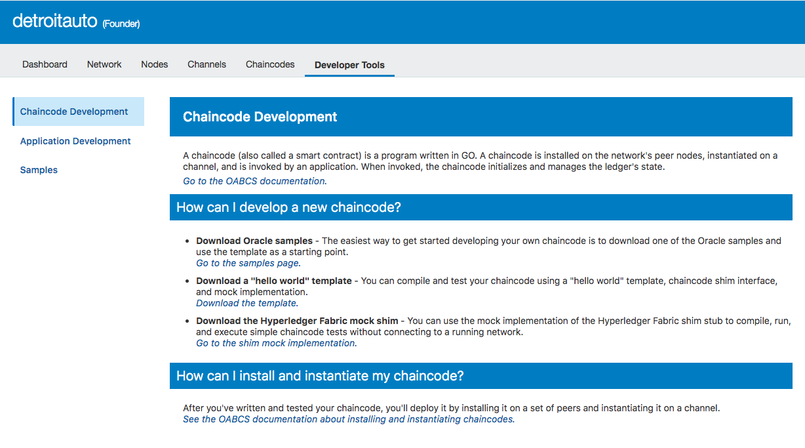

왼쪽 메뉴에서 **Samples**를 클릭합니다.
바로 테스트 해볼 수 있는 Sample인 Balance Transfer와 Car Dealer를 제공하고 있습니다.
이번 Lab에서는 **Balance Transfer**를 테스트 할 예정입니다.
**Install** 버튼을 클릭해서 바로 샘플 체인코드를 배포해 보도록 하겠습니다.
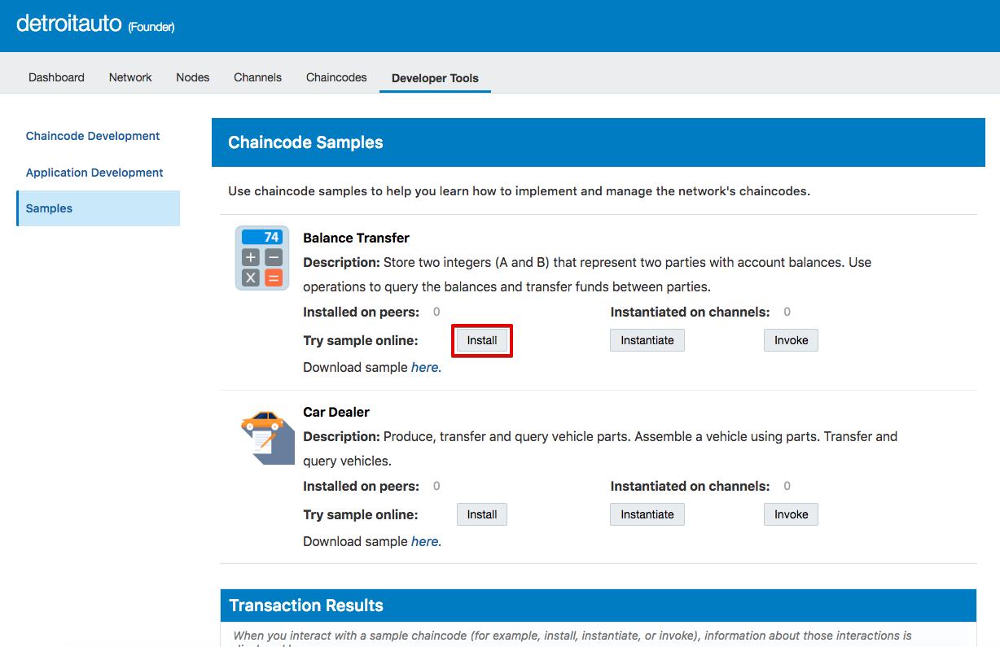

배포할 Peer를 모두 선택합니다.

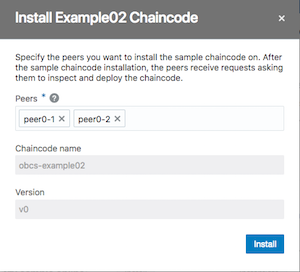

배포할 채널을 **default**로 선택합니다. 

이 체인코드는 처음 **Instantiate(객체화)** 될때 초기값을 입력받도록 작성되었는데, A와 B의 계좌잔고를 세팅하기 위해 **Int** 값을 초기에 입력받습니다. (예: A: 100, B: 200)

REST Proxy를 선택하고 **Instantiate and Enable in REST Proxy** 버튼을 클릭합니다.

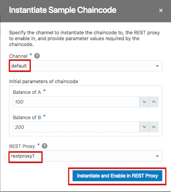

invoke 버튼을 누른 후 퍕업창에서 Channel을 선택하고 Action명을 **Query A**로 선택해서 A의 잔고값을 조회합니다.
초기에 입력한 A의 값이 조회되는 것을 확인하실 수 있습니다.

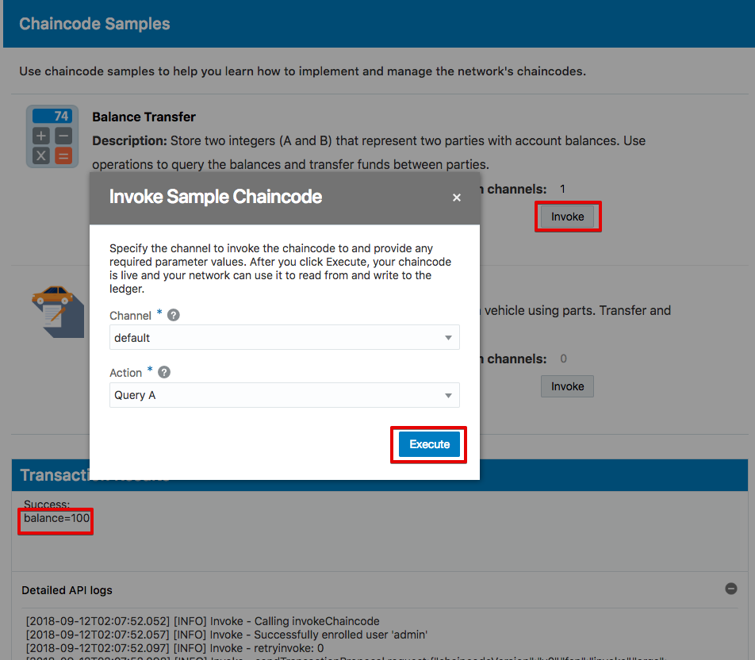

이번에는 B의 계좌에서 A의 계좌로 계좌이체를 하는 메서드를 호출 해보록 하겠습니다.
이번에도 위와 같이 **Invoke** 버튼을 눌러 팝업창을 띄웁니다.

**Transfer from B to A** 를 선택하고 Amount에 30 정도의 값을 입력합니다.

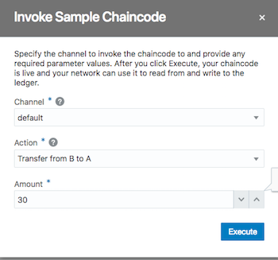

다시 이전스텝에서 했던 대로 Invoke버튼 클릭 -> **Query A**를 조회해서 아래와 같이 A의 계좌 잔고가 증가된 것을 확인합니다.

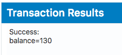

## 2. 트랜잭션 로그 확인하기

지금까지 생성하고 호출한 체인코드의 블럭이 어떻게 되어 있는지 로그를 통해 확인해보도록 하겠습니다.
Dashboard Console에서 **Channels** 메뉴를 클릭하고 지금 배포한 채널인 **default**를 선택합니다.

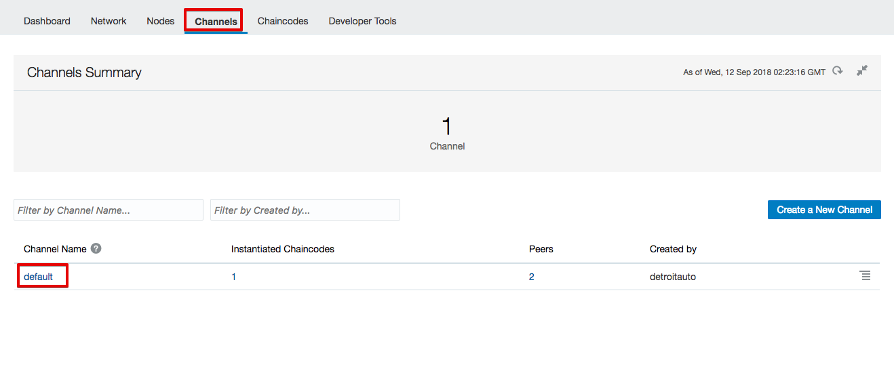

왼쪽 메뉴에서 Ledger가 먼저 선택 되어져서 나오게 됩니다.

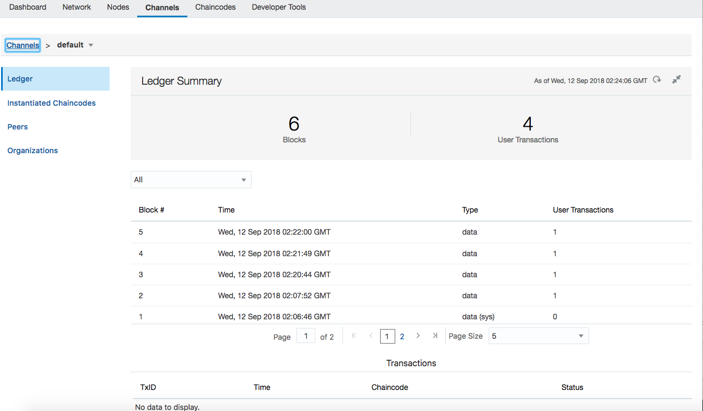

가장 처음에 생성된 **1번 Block**을 선택합니다.

TxID의 왼쪽 화살표를 클릭하면 아래에 상세 호출 내용이 나옵니다.
처음에 instantiate할때 입력한 채널명과 초기 initial 값들이 어떻게 전달되었는지를 확인할 수 있습니다.

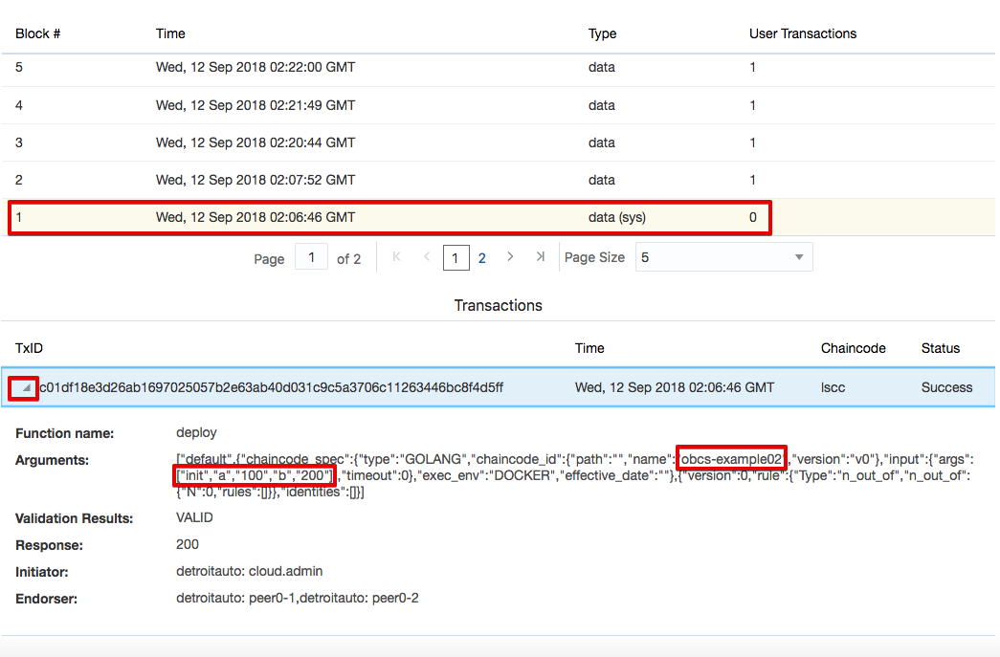

다른 블럭들도 클릭을 해서 확인해 봅니다. 아래는 query A 메서드를 호출한 로그를 확인할 수 있습니다.
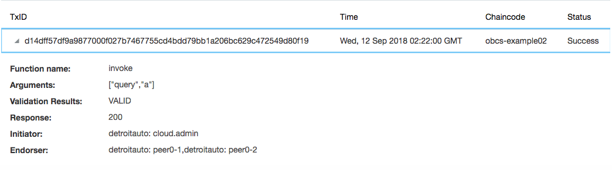

아래는 Transfer from B to A 를 한 메서드에 대한 로그입니다.
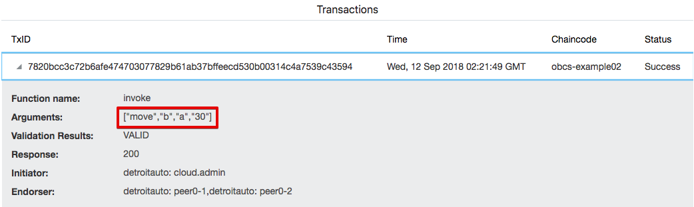

이처럼 Transaction이 발생할 때마다 저장된 내역을 Console에서 쉽게 조회할 수 있습니다.

-----
<b>수고하셨습니다. 모든 Lab 과정을 끝내셨습니다.</b>

[이전 Lab으로 이동](../README.md)
