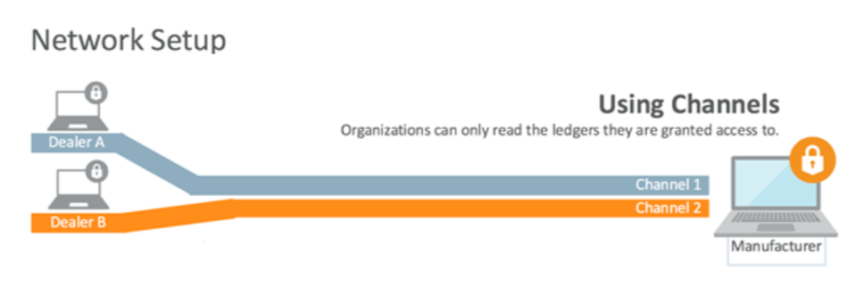
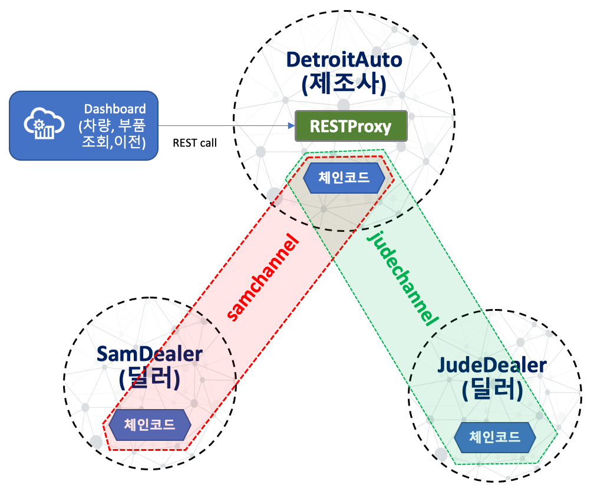

# Car Dealer Lab #
-----
## 사전 준비사항 ##
+ Oracle Blockchain Platform Ip Address - 강사 제공
+ Postman 툴 ([다운로드](https://www.getpostman.com/apps))

## 소개 ##
이번 Lab은 Car Dealer 회사에서 Oracle BlockChain Platform을 활용하여 자동차 매매에 투명성을 확보할 수 있도록 해주는 Lab 입니다.

## Lab 시나리오
대형 자동차 회사는 딜러 / 구매자의 공급망 관리하는 소프트웨어(SCM)를 원장 (blockchain)에 권한을 부여하는 방식으로 공급망 시스템을 간소화하는 것을 목표로 하고 있습니다. 최종 목표는 조정하는 노력과 차량 및 부품에 대한 감사 추적 설정과 관련된 전반적인 마찰을 줄이는 것입니다.

딜러들은 서로 거래를 하고 있지만 경쟁관계에 있기 때문에 다른 딜러 업체에서 거래의 세부 정보를 보기를 원하지 않습니다. Blockchain Platform에서는 채널을 사용하여 트랜잭션을 서로 분리하고 해당 채널을 볼 수 있는 peer에서만 해당 트랜잭션을 볼 수 있게 함으로써 이를 해결해 줍니다.

시나리오에서는 아래 그림과 같이 중앙에 제조업체 (Detroit Auto)와 두 명의 딜러 (Sam 과 Jude)를 만들고 각각의 채널로 구분합니다.

이 채널들은 차량 제조업체와 해당 딜러에서만 조회가 가능한 별도의 원장을 갖게 됩니다. 채널은 2개 뿐만 아니라 그 이상의 여러 참여자를 가질 수 있고, 블록체인 네트워크 역시 더 많은 조직 (예 : 여러 다른 부품 제조업체)을 가질 수 있지만, 이 시나리오에서는 이처럼 간단한 모델로 수행하게 됩니다.

## Lab 구성도

# Lab 시작

## 1. Multi-party Network 구성하기

### A. [Founder에 Participant 조직(Organization)을 Join하기](joinorg.md)

### B. [Channel 생성하기](createchannel.md)

---
## 2. [체인코드 배포하기](chaincode_deploy.md)
---
## 3. [Sample Web App 준비하기](create_sampleapp.md)
---
## 4. [Web App 에서 Blockchain 호출하기](invoke_blockchain.md)

-----

[이전 Lab으로 이동](../README.md)
