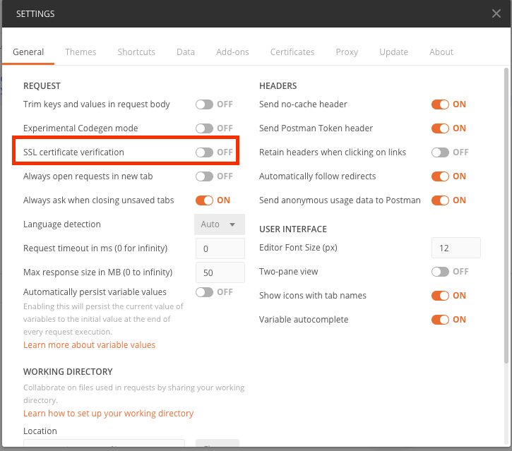
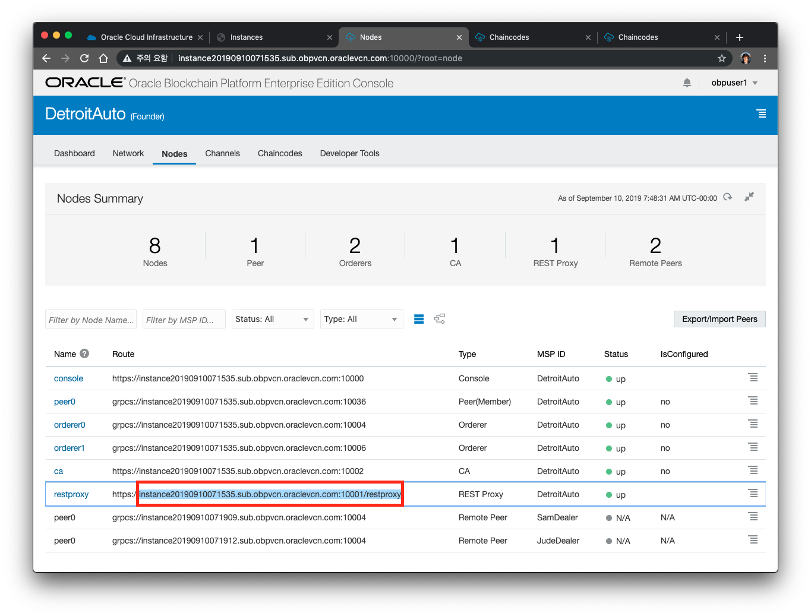
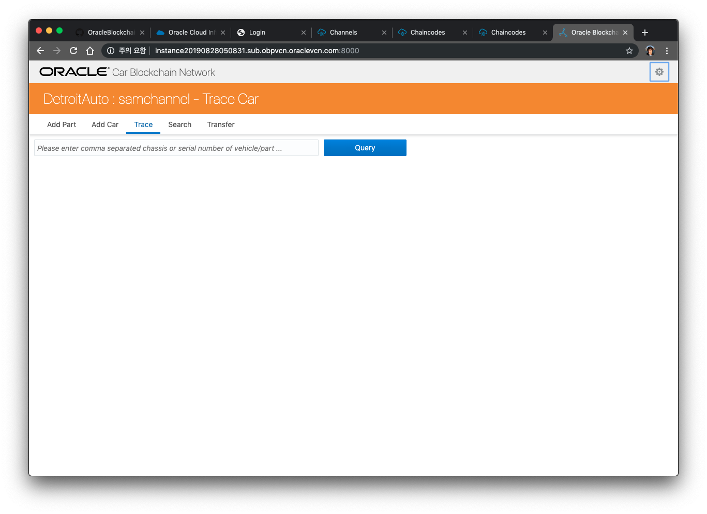

# Ledger 초기화 및 Client용 Web Application 준비하기

### A. Ledger 초기화

Oracle Blockchain Platform 에서는 REST API를 통해 체인코드를 호출할 수 있습니다.
Transaction을 호출하는 REST API의 형식은 다음과 같습니다.
<pre><code>
POST https://RESTAPI주소/api/v2/channels/{CHANNEL이름}/transactions

Headers: 
Content-Type: application/json

Body: {
   "chaincode":"{chaincode_name}", 
   "args":["{함수명}", "{입력인자 배열}"]
}
</code></pre>
이를 사용해서 샘플 Application의 데이터를 초기화하는 과정을 진행하도록 하겠습니다.

체인 코드가 업로드 되어 인스턴스화 되었으며 REST 게이트웨이를 통해 원격으로 호출 될 수 있으므로 체인 코드 기능을 호출하고 원장을 쿼리 할 수 있습니다. 원장은 현재 완전히 비어 있으므로 의미있는 데이터를 얻기 위해 장부에 샘플 데이터를 추가하도록 하겠습니다.

이번 Lab에서는 Postman툴([다운로드](https://www.getpostman.com/apps))을 통해 REST API들을 자동화해서 호출하는 방식으로 하게 됩니다.
1. Postman을 통해 REST URL을 호출을 하게 되는데, 이때 SSL을 통해 호출을 합니다. 본 Lab에서 사용하는 서버의 SSL인증서가 Test인증서로 되어 있기 때문에 호출도중 ssl 에러가 발생하게 됩니다. 이를 해결하기 위해 ssl verification을 체크하는 설정을 해제해야 합니다.
   Postman의 Setting(메뉴에서 File->Settings(윈도우), 메뉴에서 Postman->Preferences(Mac)) 화면에서 다음과 같이 SSL certificate verification을 체크해제(OFF) 합니다.
   

2. 먼저 DetroitAuto(Founder)의 Nodes 탭에서 REST Proxy주소를 복사해 둡니다. 
   아래 그림에서 https://를 제외한 가운데 붉은색으로 표시된 부분만 복사를 합니다. 
    

3. 데이터를 초기화하는 Postman 스크립트 파일은 아래의 주소에서 로컬 컴퓨터에 다운로드 합니다.

    [OBP_Workshop.postman_collection.json](https://github.com/OracleCloudKr/OracleBlockchain_Workshop/raw/master/CarDealerLab/artifacts/OBP_Workshop.postman_collection.json)

    [OBP_WORKSHOP_ENV.postman_environment.json](https://github.com/OracleCloudKr/OracleBlockchain_Workshop/raw/master/CarDealerLab/artifacts/OBP_WORKSHOP_ENV.postman_environment.json)

4. 위 2개의 json 파일 중 OBP_WORKSHOP_ENV.postman_environment.json을 여십시오.
    그 중에서 아래에 value중 굵게 표시된 부분을 각자의 환경에 맞도록 수정합니다.
    <pre>
    <code>
        {
        "key": "resturl",
        "value": "<B>xxxxx.sub.obpvcn.oraclevcn.com:10001/restproxy</B>",
        "description": "",
        "enabled": true
        },
    </code>
    </pre>
5. 먼저 Postman을 실행한 후 import 버튼을 눌러 창을 띄우고, 위 두 개의 파일을 import 합니다.

    

6. 오른쪽 상단의 OBP_WORKSHOP_ENV 를 선택해서 환경파일을 적용합니다.
   아래 그림과 같이 OBP_Workshop이라고 하는 Collection이 만들어지고 Http Requests들이 모두 import 된 것을 확인합니다. 이 요청들을 모두 실행하기 위해 왼쪽 상단에 있는 Runner 버튼을 누릅니다.

1. OBP_Workshop을 선택하고, Environment에서 OBP_WORKSHOP_ENV 를 선택한 후 아래에 있는 RUN 버튼을 클릭합니다.

1. 모든 요청들이 설정한 OBP Founder쪽 REST API 서버로 들어가게 됩니다.
   
   이 요청들은 샘플 App을 위하여 Ledger의 초기데이터를 적재하는 API들을 호출하게 됩니다.

### B. Sample Web App 준비
CarTrace 체인코드를 개발 한 후에는 보통 이를 호출하기 위한 Web Application을 개발하게 됩니다. 체인코드로의 호출은 SDK를 이용해도 되고 REST API를 이용해서 개발을 할 수도 있습니다. 이 Lab에서는 REST API를 이용해서 체인코드를 호출하는 Sample Web Application을 미리 준비해 놓았습니다.
이 Application은 자동차 부품과 자동차를 생성하는 API를 호출합니다. 또한 조회 및 다른 조직으로 Transfer를 수행하는 API를 호출하게 됩니다. 이 Application에서는 데이터 결과를 화면에 출력하기만 하고 실제 동작은 Chaincode에서 수행되게 됩니다.

이 Application은 각 Blockchain workshop 인스턴스의 8000 포트로 접근할 수 있습니다.
<pre><code>
예:) http://62C57E2D8944EBB48B1E6C5A28A461.blockchain.ocp.oraclecloud.com:8000/

주의: https 가 아니라 http로 접근하셔야 합니다. 
</pre></code>

---
[이전 Lab으로 이동](README.md)