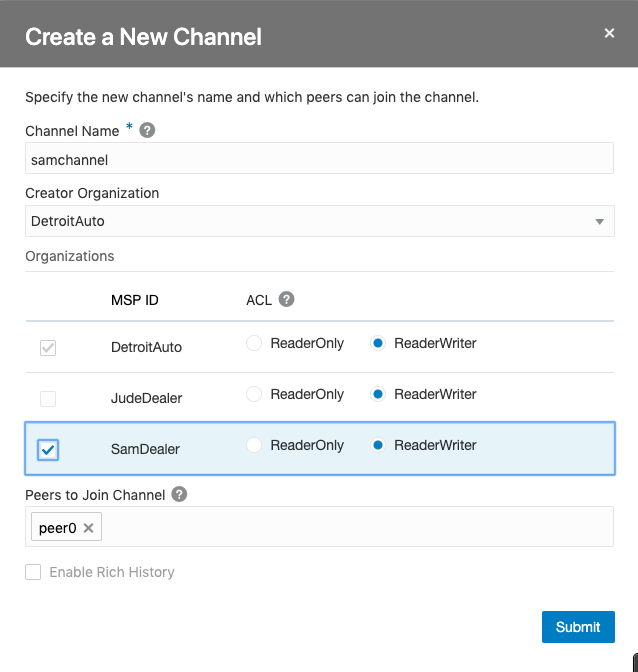
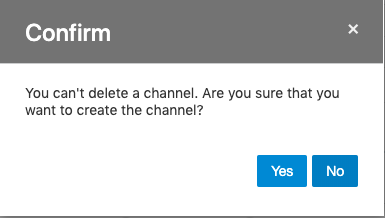
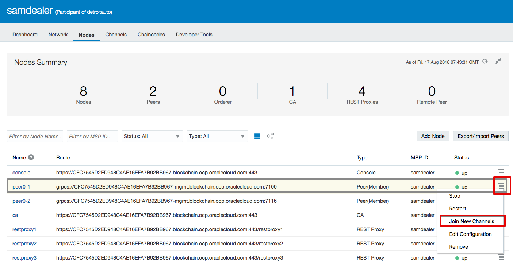
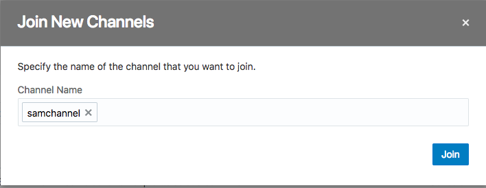
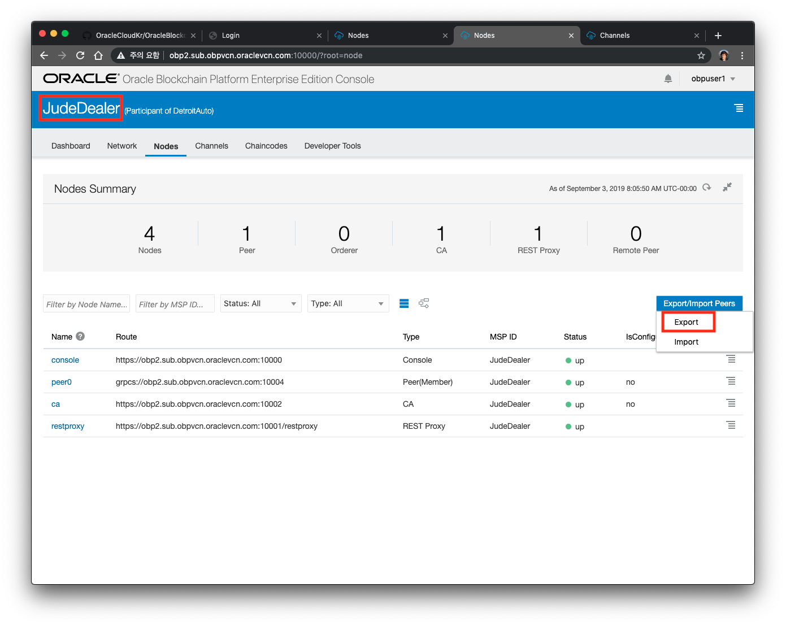
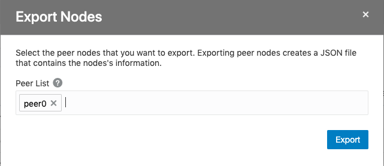
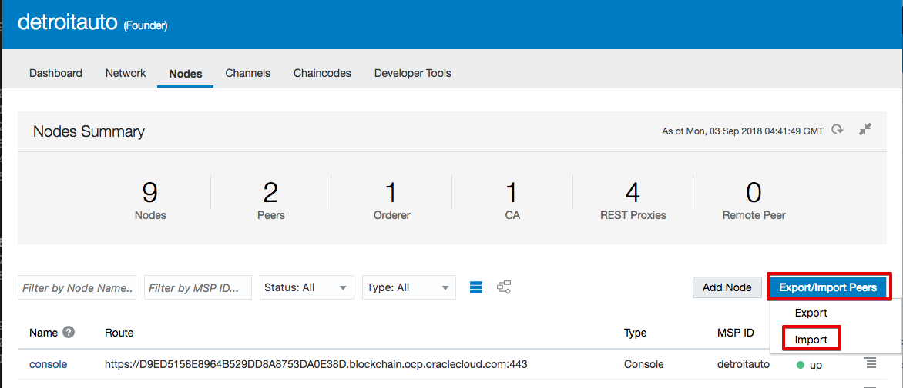
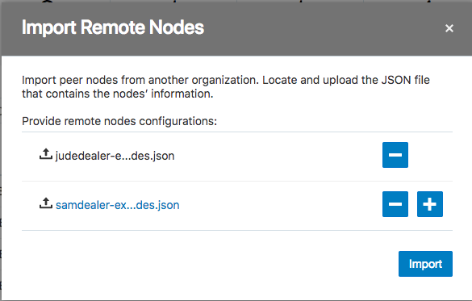
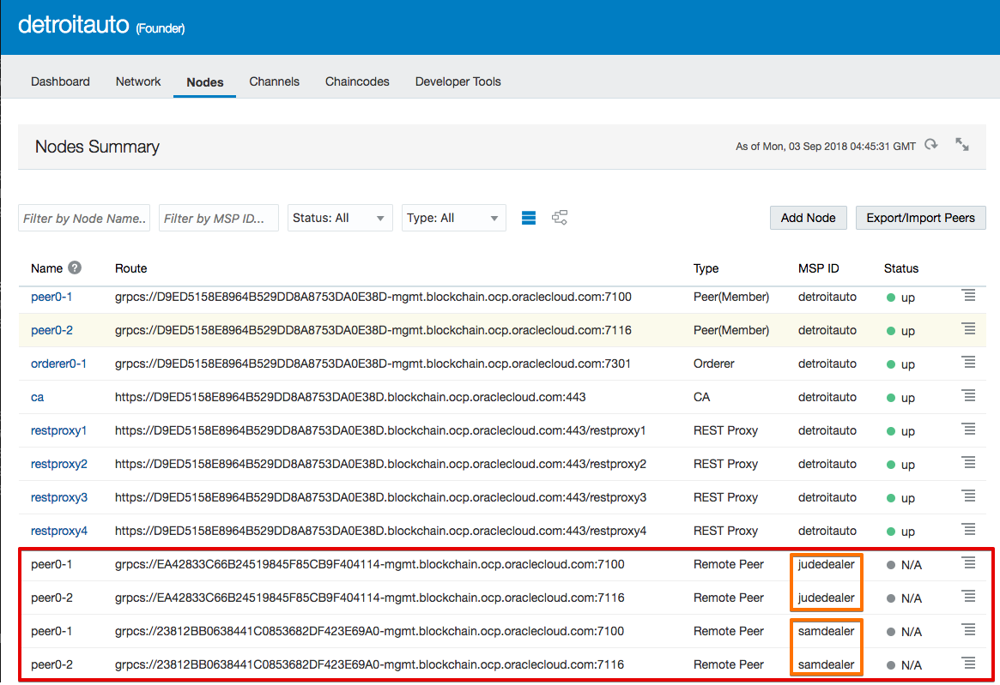
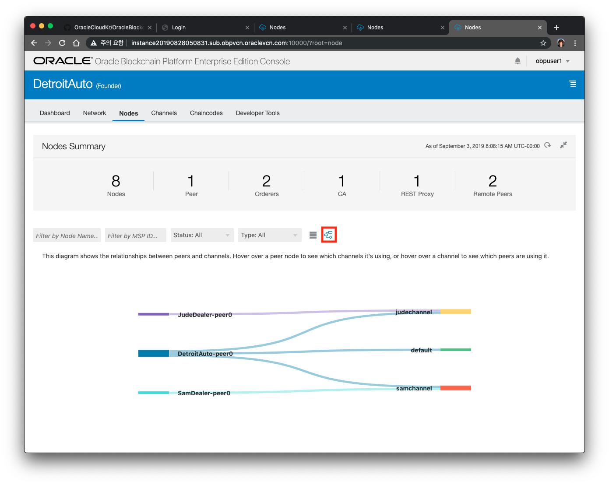

#  Channel 생성하기

Multi-Party 블록 체인 네트워크를 설정하는 마지막 단계는 각 딜러의 거래를 다른 딜러의 거래와 분리하기 위해 각 딜러의 채널을 만드는 것입니다. 이 시나리오에서는 두 명의 각 대리점을 위한 별도의 채널을 만들 것입니다.

## 1. Channel 생성

먼저 **Founder Org(detroitauto)** 의 콘솔에서 **Channels** 탭으로 이동하십시오. 그런 다음 **Create a New Channel**를 클릭하십시오
**samchannel**과 **judechannel** 두개의 채널을 만들면 됩니다. 각 두개의 채널에 대해 **ReaderWriter**가 포함되어 있고 Detroit Auto Peer의 피어가 모두 채널에 가입되어 있는지 확인하십시오.
    
| Channel Name | MSP ID    | ACL         |
| ------------ | --------- | ----------- |
| samchannel   | samdealer | ReaderWriter|
| judechannel  | judedealer| ReaderWriter| 
    

한번 생성된 채널은 삭제할 수 없기 때문에, 이름 생성시 주의하시기 바랍니다. 다시 한번 확인한 후에 Yes를 누릅니다.

두 개의 채널을 모두 생성 한 후에 다음 단계로 넘어갑니다.

## 2. Participant(딜러) nodes에서 채널에 참가하기 (**samdealer** 먼저 수행합니다.)
앞에서 만든 채널은 각각의 딜러들이 참여할 수 있다는 정보만을 입력한 것이므로 현재는 아직 참여가 되어 있지 않은 상태로, Detroit Auto의 피어 노드만 포함되어 있습니다. 딜러들은 참여하는 노드가 없으므로 이 채널에서 트랜잭션을 만들거나 트랜잭션을 볼 수 없습니다.
    
생성된 채널에 참여하려면 Participant Org의 콘솔에 액세스하십시오. 
**Nodes** 탭으로 이동하여 각 피어 노드(peer0-1, pee0-2)에 대하여 햄버거 메뉴를 클릭 한 다음 **Join New Channels**를 선택하십시오.
채널 이름을 묻는 대화 상자가 표시됩니다. 조인할 채널명은 어떤 Org에서 작업하냐에 땨라 달라집니다. 다음 표를 보고 Org와 Channel을 잘 선택한 다음 **Join**을 클릭하십시오.
    
| Participant Org | MSP ID     | 대상 Peer    |
| --------------- | ---------- | ----------- |
| samdealer       | samchannel | peer0-1, peer0-2|
| judedealer      | judechannel| peer0-1, peer0-2| 
    

- 주의사항
    - peer0-1, peer0-2 모두 채널에 Join 시킵니다.   
    - judedealer에 대해서도 동일한 작업을 수행합니다.

## 3. Endorsing을 위한 Participant 정보를 Founder에 추가하기
Endorsing단계에서 Founder뿐만 아니라 다른 Org에서도 검증을 하도록  할 수 있습니다.

Founder가 다른 Org를 Transaction 의 endorser로 포함 시키려면 다른 피어 노드에 대해 알아야 합니다. 이렇게 하기 위해 Participant에서 노드 정보를 내보내고 Founder에서 가져와야 합니다.

Participant Org에서 **Nodes** 탭으로 이동 한 다음 **Export / Import** 버튼을 클릭하여 노드 정보를 내보냅니다. Participant의 Peer(peer0-1, peer0-2)를 모두 선택한 다음 **Export**를 클릭하고 결과 파일을 저장합니다.

위에서 노드 정보 내보내기를 완료한 후에, **Founder(DetroitAuto)** 화면에서 **Export / Import** 버튼과 **Import** 옵션을 통해 **Node** 탭에서 가져올 수 있습니다. 위에서 Export한 원격 노드 구성의 두 세트를 모두 업로드하십시오. 

프로세스가 정상적으로 완료되면 다른 Org의 Peer 노드가 목록에 나타나야 합니다. MSP(Membership Service Provider)를 통해 네트워크에 속한 조직을 추적할 수 있습니다.

## 4. 2 ~ 4 과정을 **judedealer**에서도 수행합니다.

## 5. Network구성 Review하기
지금까지 구축한 네트워크에 대한 구성도를 Founder "Nodes" 탭으로 이동하여 확인할 수 있습니다. Dealer의 피어 노드뿐 아니라 Detroitauto 노드가 목록에 있는지 확인하십시오. 

그런 다음 아래 그림의 빨간색으로 표시된 토폴로지 보기 버튼을 클릭하십시오.

이 네트워크 구성도는 이 Lab에서 처음에서 계획한 것과 유사합니다 (내부 채널로 detroitautoorderer가 추가됨). 토폴로지가 여기에 표시된 것과 같지 않거나 피어가 목록에 없으면 누락 된 항목을 확인한 다음 해당 구성 요소를 가져오거나 내보내거나, 채널 구성을 확인하십시오.

---
[이전 Lab으로 이동](README.md)
