#  Channel 생성하기

블록 체인 네트워크를 설정하는 마지막 단계는 각 딜러의 거래를 다른 딜러의 거래와 분리하기 위해 각각의 채널을 만드는 것입니다. 이 시나리오에서는 두 명의 각 Dealer를 위한 별도의 채널을 만들 것입니다.

## A. Channel 생성

1. 먼저 **Founder Org(detroitauto)** 의 콘솔에서 **Channels** 탭으로 이동하십시오. 기본적으로 생성된 default 채널이 있습니다. 채널을 생성하기 위해 **Create a New Channel**를 클릭하십시오
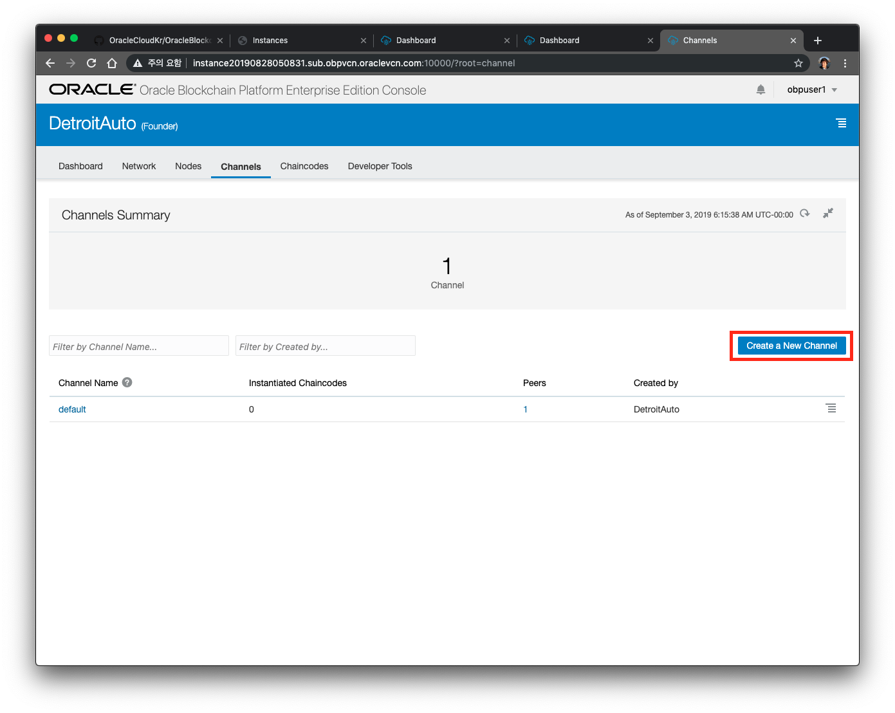

2. **samchannel**과 **judechannel** 두개의 채널을 만들면 됩니다. 각 두개의 채널에 대해 **ReaderWriter**가 포함되어 있고 Detroit Auto Peer의 피어가 모두 채널에 가입되어 있는지 확인하십시오.
    
    | Channel Name | MSP ID    | ACL         |
    | ------------ | --------- | ----------- |
    | samchannel   | SamDealer | ReaderWriter|
    | judechannel  | JudeDealer| ReaderWriter| 
    
    

3. 한번 생성된 채널은 삭제할 수 없기 때문에, 이름 생성시 주의하시기 바랍니다. 다시 한번 확인한 후에 Yes를 누릅니다.

4. JudeChannel도 생성합니다.

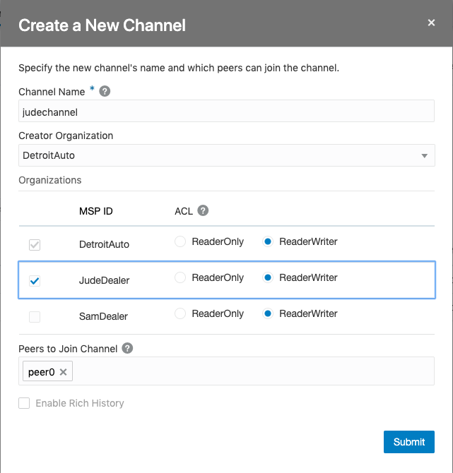

1. 두 개의 채널을 모두 생성 한 후에 다음 단계로 넘어갑니다.

## B. Participant(딜러) nodes에서 채널에 참가하기 (**JudeDealer** 먼저 수행합니다.)
앞에서 만든 채널은 Founder쪽에 각각의 딜러들이 참여할 수 있다는 정보만을 입력한 것이므로 현재는 아직 참여가 되어 있지 않은 상태로, Detroit Auto의 피어 노드만 포함되어 있습니다. 딜러들은 참여하는 Peer가 없으므로 이 채널에서 트랜잭션을 만들거나 트랜잭션을 볼 수 없습니다.
    
1. 생성된 채널에 참여하려면 Participant Org의 콘솔에 액세스하십시오. 먼저 JudeDealer 콘솔로 이동합니다.
**Nodes** 탭을 클릭하여 각 피어(peer0)에 대하여 햄버거 메뉴를 클릭 한 다음 **Join New Channels**를 선택하십시오.
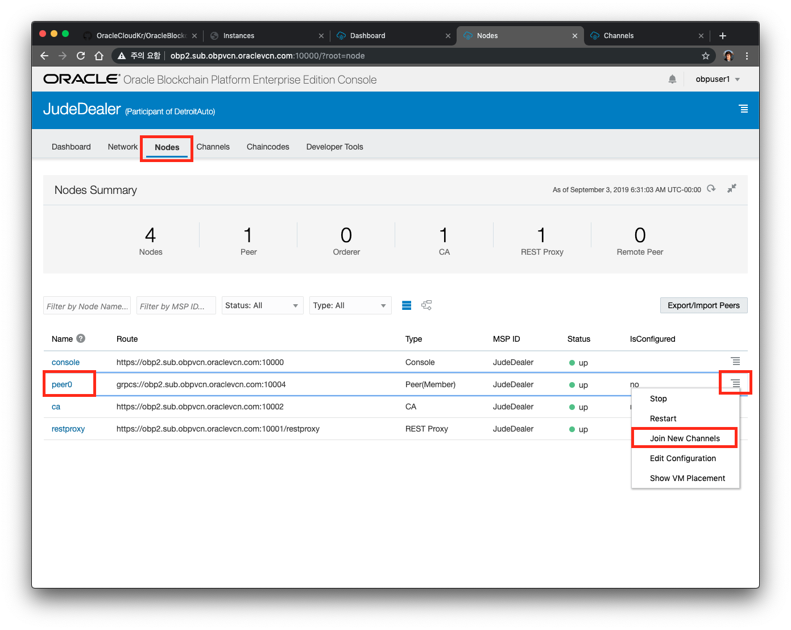

2. 채널 이름을 묻는 대화 상자가 표시됩니다. 조인할 채널명은 어떤 Org에서 작업하냐에 땨라 달라집니다. 다음 표를 보고 Org와 Channel을 잘 선택한 다음 **Join**을 클릭하십시오.
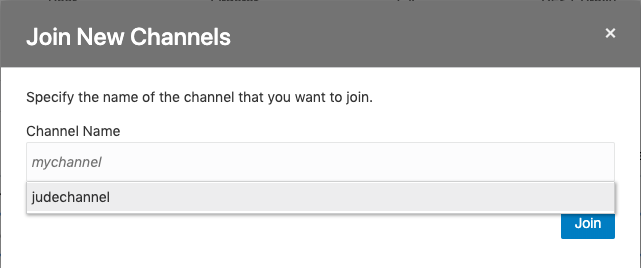
    
    | Participant Org | MSP ID     | 대상 Peer    |
    | --------------- | ---------- | ----------- |
    | SamDealer       | samchannel | peer0 |
    | JudeDealer      | judechannel| peer0 | 

3. SamDealer에도 위와 동일한 작업을 수행합니다. SamDealer 콘솔로 이동합니다.
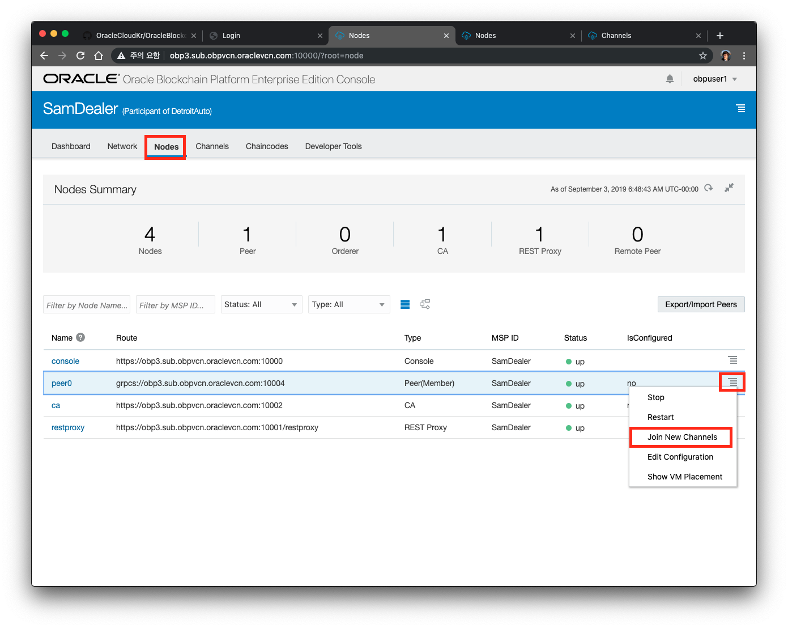
   
4. Join New Channel을 클릭해서 samchannel을 추가합니다.
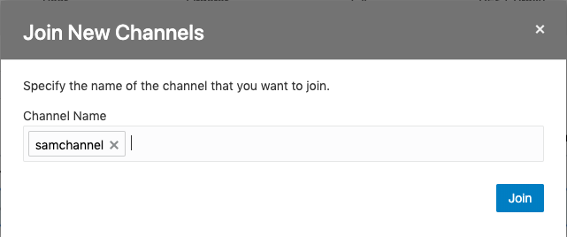

## C. Endorsing을 위한 Participant 정보를 Founder에 추가하기

체인코드를 실행하기 전에 검증(Endorsing)단계에서 Founder peer뿐만 아니라 다른 Org에서도 검증을 하도록 할 수 있습니다. 
Founder가 다른 Org를 Transaction 의 endorser로 포함 시키려면 다른 피어 노드에 대해 알아야 합니다. 이렇게 하기 위해 Participant에서 peer노드 정보를 내보내고 Founder에 추가해야 합니다.

1. Participant Org에서 **Nodes** 탭으로 이동 한 다음 **Export / Import** 버튼을 클릭하여 노드 정보를 내보냅니다.

2. Participant의 Peer(peer0)를 선택한 다음 **Export**를 클릭하고 결과 파일을 저장합니다.

3. **Founder(DetroitAuto)** 화면의 **Node** 탭에서 **Export / Import** 버튼과 **Import** 옵션을 통해 Peer정보를 가져옵니다.
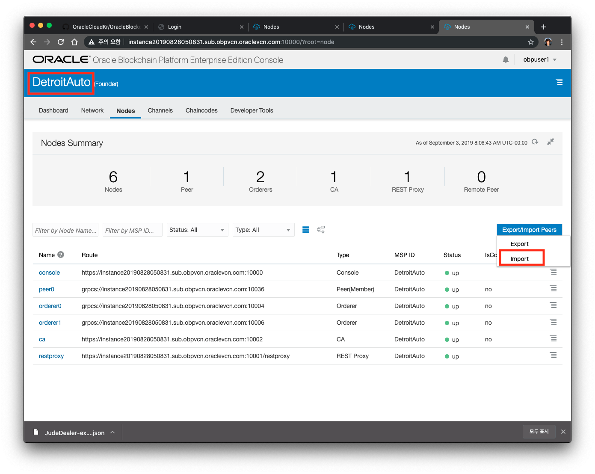

4. JudeDealer-exported-nodes.json 을 선택해서 열기 버튼을 누릅니다. Import 버튼을 누릅니다.
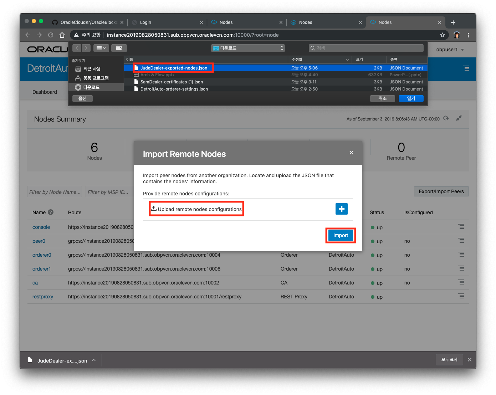

5. SamDealer에 대해서도 동일하게 반복 수행합니다. SamDealer 콘솔->Nodes 탭을 선택하고 Export/Import Peers를 클릭한 후 Export 를 선택합니다.
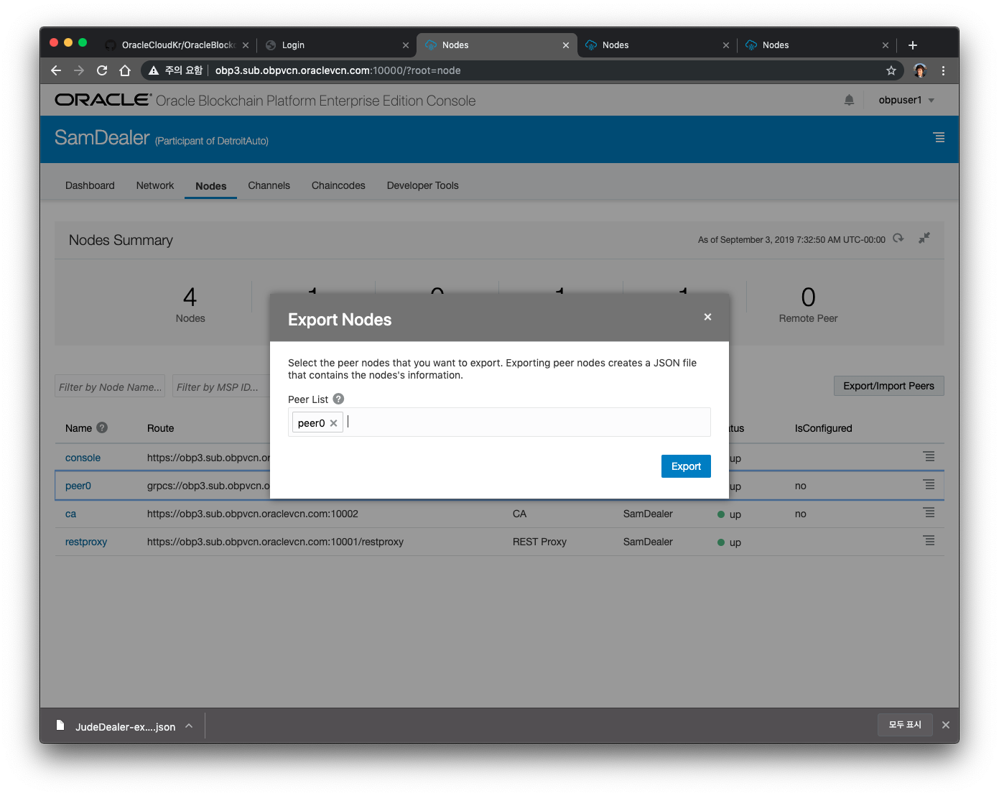

6. **Founder(DetroitAuto)** 화면의 **Node** 탭에서 **Export / Import** 버튼과 **Import** 옵션을 통해 Peer정보를 가져옵니다. SamDealer-exported-nodes.json를 선택합니다.
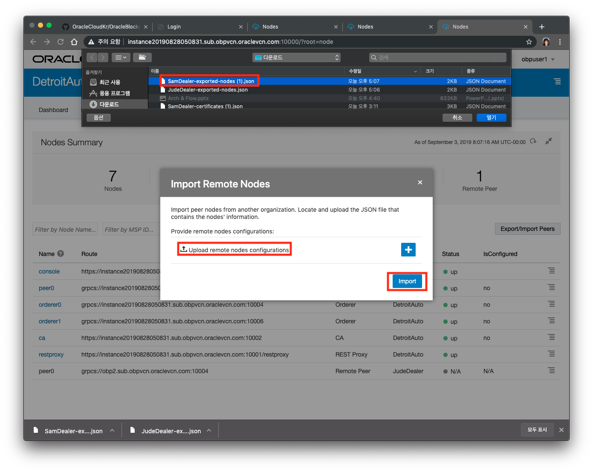

7. 위 과정이 모두 정상적으로 완료되면 다른 Org의 Peer 노드가 Founder의 Nodes 목록에 나타나야 합니다. MSP(Membership Service Provider)를 통해 네트워크에 속한 조직을 추적할 수 있습니다.
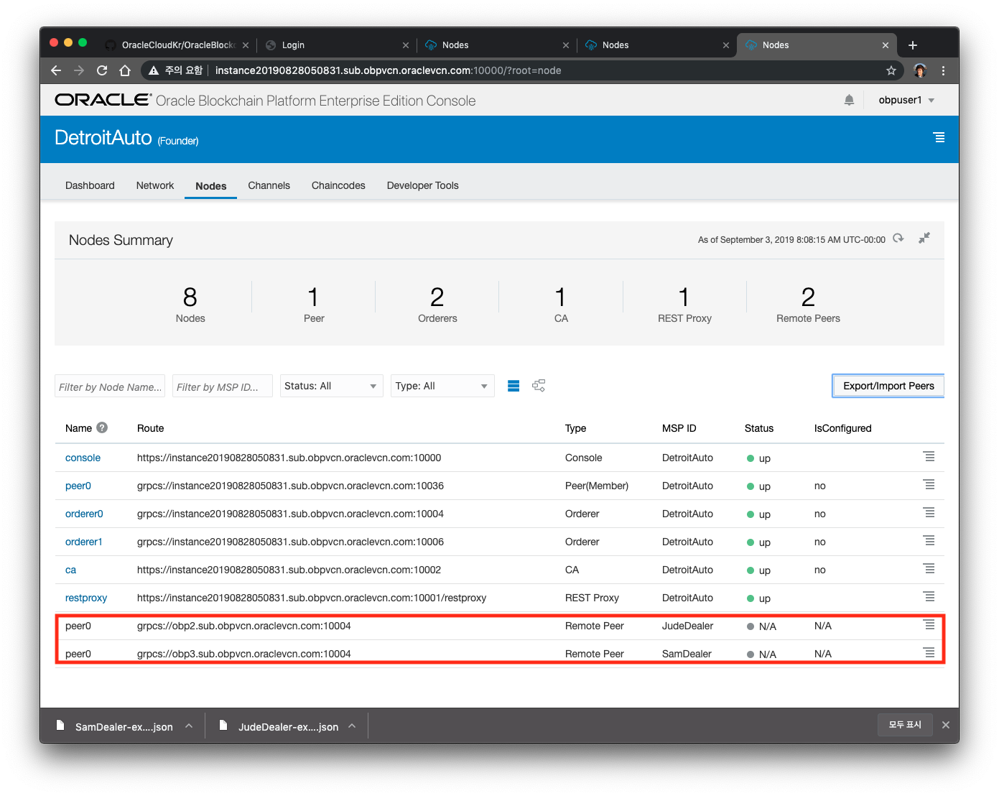

## C. Network구성 Review하기
지금까지 구축한 네트워크에 대한 구성도를 Founder "Nodes" 탭으로 이동하여 확인할 수 있습니다. Dealer의 피어 노드뿐 아니라 Detroitauto 노드가 목록에 있는지 확인하십시오.  
그런 다음 아래 그림의 빨간색으로 표시된 토폴로지 보기 버튼을 클릭하십시오.

이 네트워크 구성도는 이 Lab에서 처음에서 계획한 것과 유사합니다. 토폴로지가 여기에 표시된 것과 같지 않거나 피어가 목록에 없으면 누락 된 항목을 확인한 다음 해당 구성 요소를 가져오거나 내보내거나, 채널 구성을 확인하십시오.

---
[이전 Lab으로 이동](README.md)
