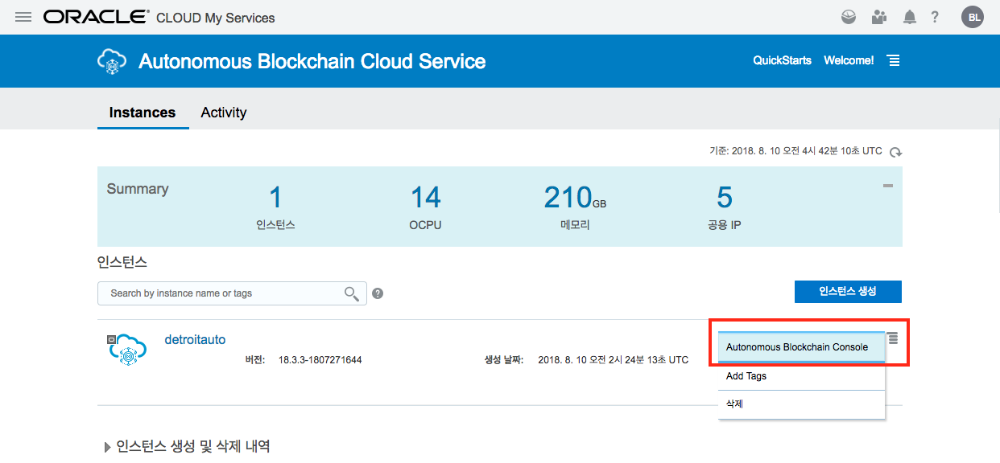

# 인스턴스 생성하기

1. OABCS(Oracle BlockChain Cloud Service) Console 에 접속하기  
OABCS에 접속하기 위해서는 Cloud Console에서 다음과 같이 선택해서 `Open Service Console`을 클릭합니다.

2. Organization(조직) 생성하기 Provisioning
처음 접속을 한 경우에는 아래와 같이 나오게 됩니다.  
오른쪽에 있는 인스턴스 생성 버튼을 누릅니다.

3. 이제 메인이 되는 DetroitAuto의 BlockChain Network를 만들 예정입니다.  
서비스 이름을 **detroitauto** 라고 입력한 후 Next 버튼을 누릅니다.  

4. Next를 누른후 다음 화면에서 Confirm 버튼을 누릅니다.
몇 분 후에 아래와 같이 인스턴스가 생성이 되게 됩니다.

5. 오른쪽의 햄버거 버튼을 클릭 한 후에 Autonomous Blockchain Console을 선택합니다.

6. 새롭게 생성된 detroitauto Founder의 Console 화면으로 이동합니다.

7. 다시 Autonomous Blockchain Cloud 화면으로 이동합니다.

8. 이번에는 다른 Dealer들을 Participant(Organization)로 만드는 과정을 구성해보도록 하겠습니다. 
   
    인스턴스 생성을 클릭해서 생성화면으로 이동한 후 아래와 같이 정보를 입력합니다.
    먼저 **Jude Dealer**를 생성하도록 하겠습니다.
    여기서는 새로운 네트워크를 생성하는 Founder가 아니기 때문에 **Create a new Network 체크를 해제** 합니다.
    

1. 동일한 과정을 거쳐 **Sam Dealer** 를 생성하도록 하겠습니다.

---
[이전 Lab으로 이동](README.md)
