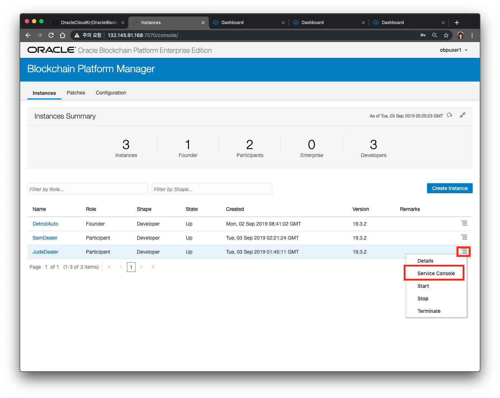
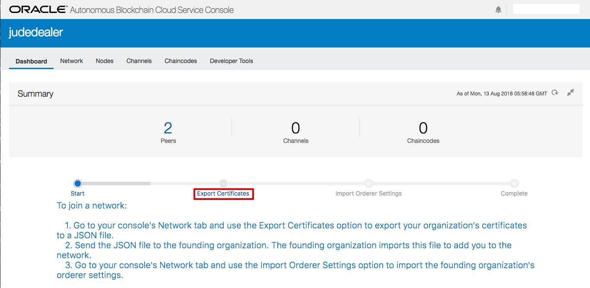
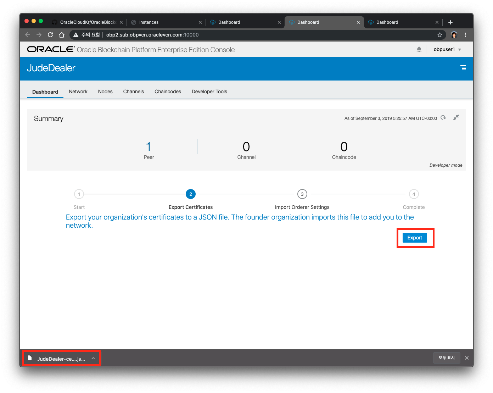
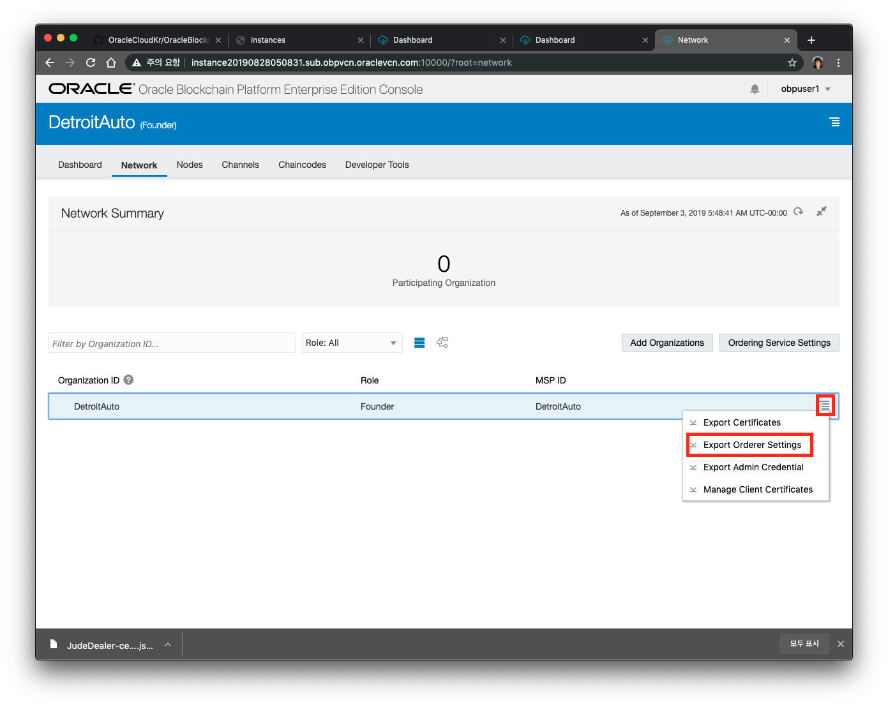
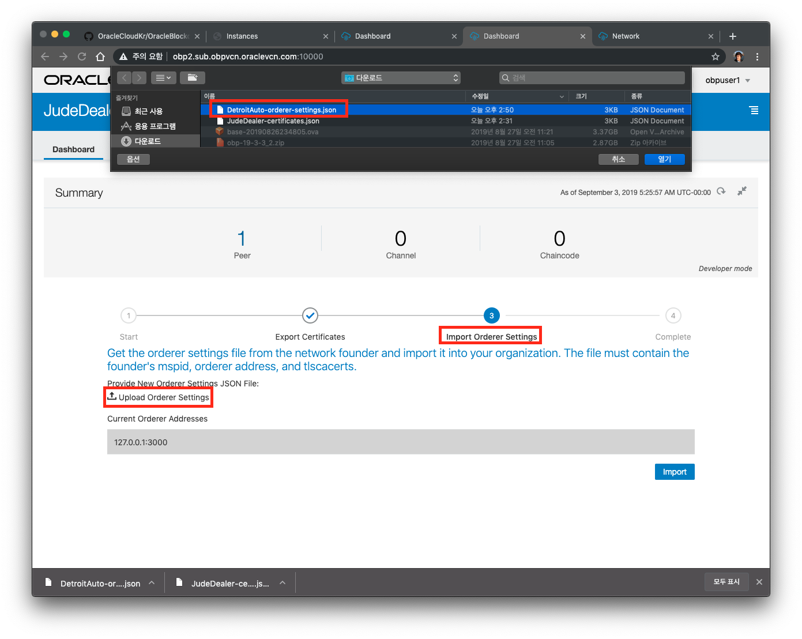
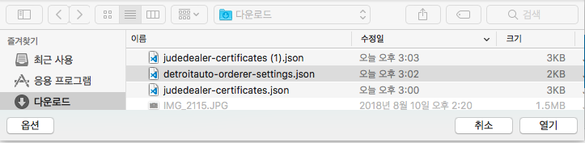
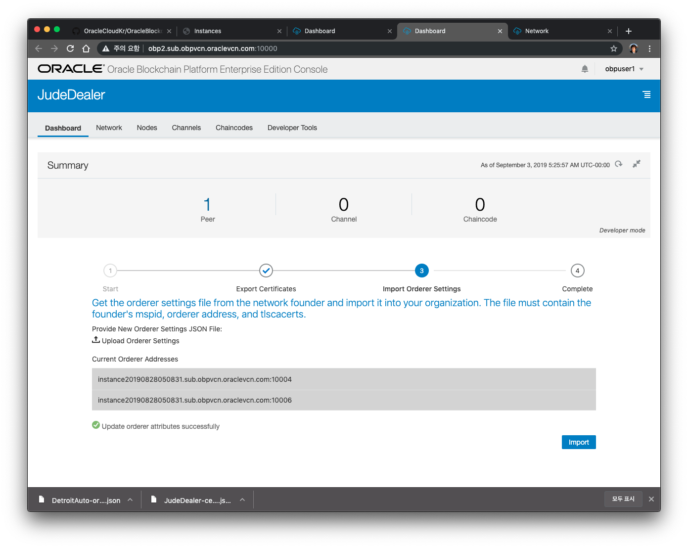
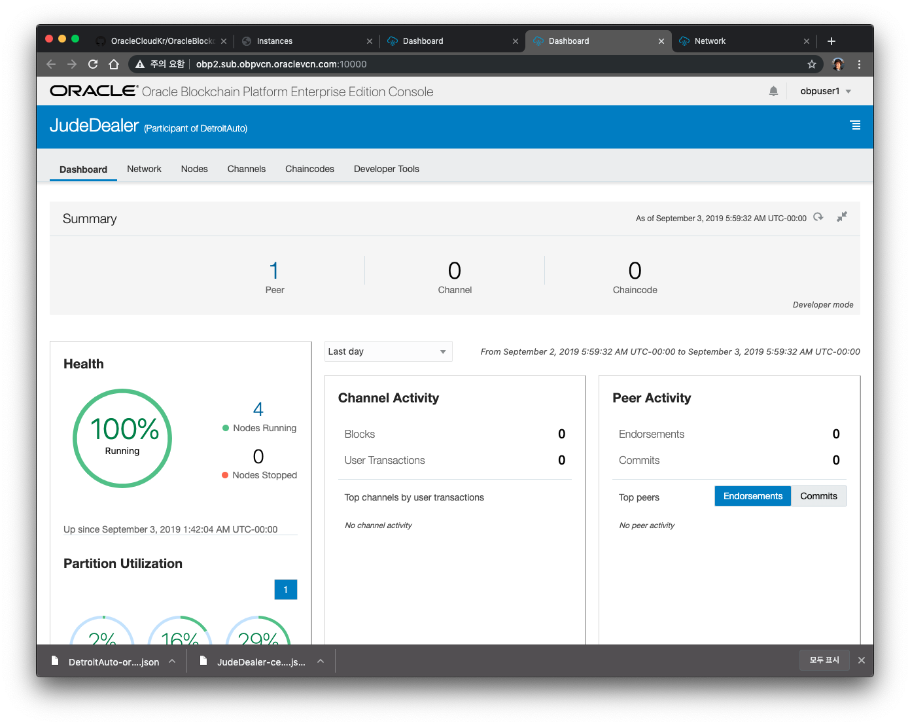
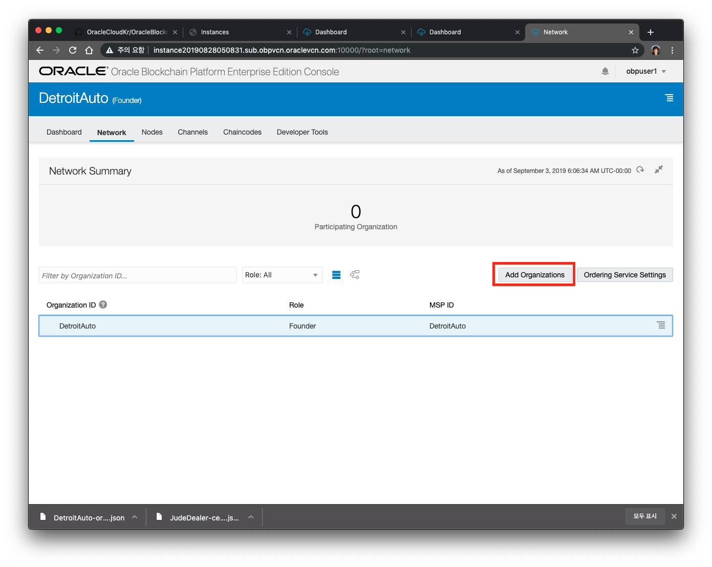
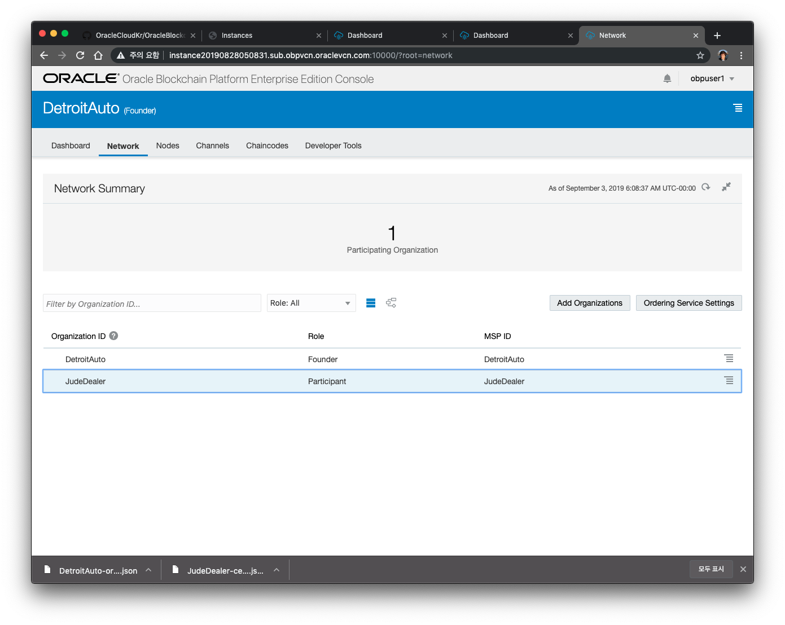

# Founder에 Participant Org Join
### A. Founder에 JudeDealer Participant 조직(Organization)을 Join하기
1. 네트워크가 생성되면 각각의 관리 콘솔에 액세스 할 수 있습니다.  
먼저 **judedealer** 의 콘솔에 접속합니다.

2. Founder는 Participant Org의 두 가지 정보가 필요합니다. 첫째는 참가하는 Org를 검증 하기 위한 인증서가 필요하고, 두번째는 Org에서 관리하는 피어 노드에 대한 정보입니다. 피어 정보는 이후 프로세스까지 필요하지 않습니다. 
Participant의 인증서를 가져오기 위해 Participant Org의 콘솔(**judedealer console**)을 엽니다. 
**네트워크** 탭에서 햄버거 메뉴를 클릭하고 딜러 조직에서 **인증서 내보내기**를 선택하여 인증서를 내보낼 수 있습니다. 
내보낸 파일을 저장하십시오.

3. **Export** 버튼을 눌러 **judedealer-certificates.json** 파일을 서버로 부터 로컬 컴퓨터에 다운로드 합니다.  
접속하고자 하는 Founder의 Orderer 정보를 import 해야 합니다. **Import Orderer Settings**를 클릭합니다.

4. **DetroitAuto** Founder 조직의 콘솔로 이동해서 **네트워크** 탭을 선택하십시오. 그런 다음 **DetroitAuto** 조직의 햄버거 메뉴를 클릭하여 Orderer 설정파일을(detroitauto-orderer-settings.json) 내보냅니다. 내보낸 파일을 저장하십시오.

5. 다시 **judedealer** 조직의 콘솔로 이동해서 **Upload Orderer Settings** 를 클릭합니다.

6. 위에서 다운로드 한 **detroitauto-orderer-settings.json** 를 선택합니다.

7. 선택한 파일이 정상적으로 upload 되면, 이 파일을 Import를 클릭해서 반영합니다. 마지막으로 Complete 단계를 클릭합니다.

8. 이제 Judedealer의 메인화면이 정상적으로 열립니다.

9. 이제 지금까지 JudeDealer를 구성했고, JudeDealer에 대한 정보도 얻었습니다. 일반적으로 이 프로세스는 단일 사용자가 수행하지 않으며 대신 새로운 조직을 Blockchain 네트워크에 탑재하기 위해 메타 데이터를 전송해야 합니다. Oracle Blockchain Cloud Service는 서로 알려진 조직에게만 액세스 권한이 부여되는 'permissioned' 네트워크이며, 지금 하고 있는 작업을 통해 활성화가 되게 됩니다.

Founder에도 **JudeDealer**를 추가해주어야 합니다. Founder 콘솔의 Network로 이동해서 **Add Organizations** 버튼을 클릭합니다.

10. **Upload Organization Certificates** 버튼을 클릭한 후 앞에서 다운로드 한 **judedealer-certificates.json** 파일을 선택하고 Add 버튼을 눌러 Org를 추가합니다.

11. 다음과 같이 judedealer 가 Participant로 정상적으로 등록된 것을 확인할 수 있습니다.

### B. Founder에 SamDealer Participant 조직(Organization)을 Join하기
위와 동일한 방식으로 **SamDealer** Org를 Founder에 추가합니다. 

---
[이전 Lab으로 이동](README.md)
