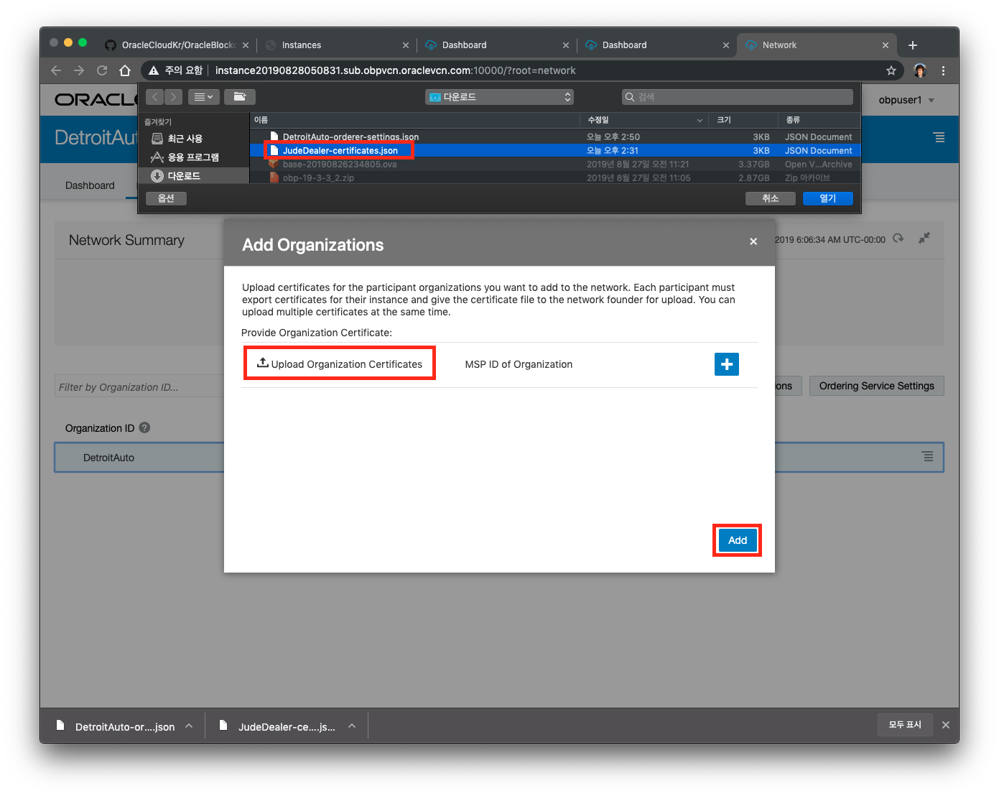
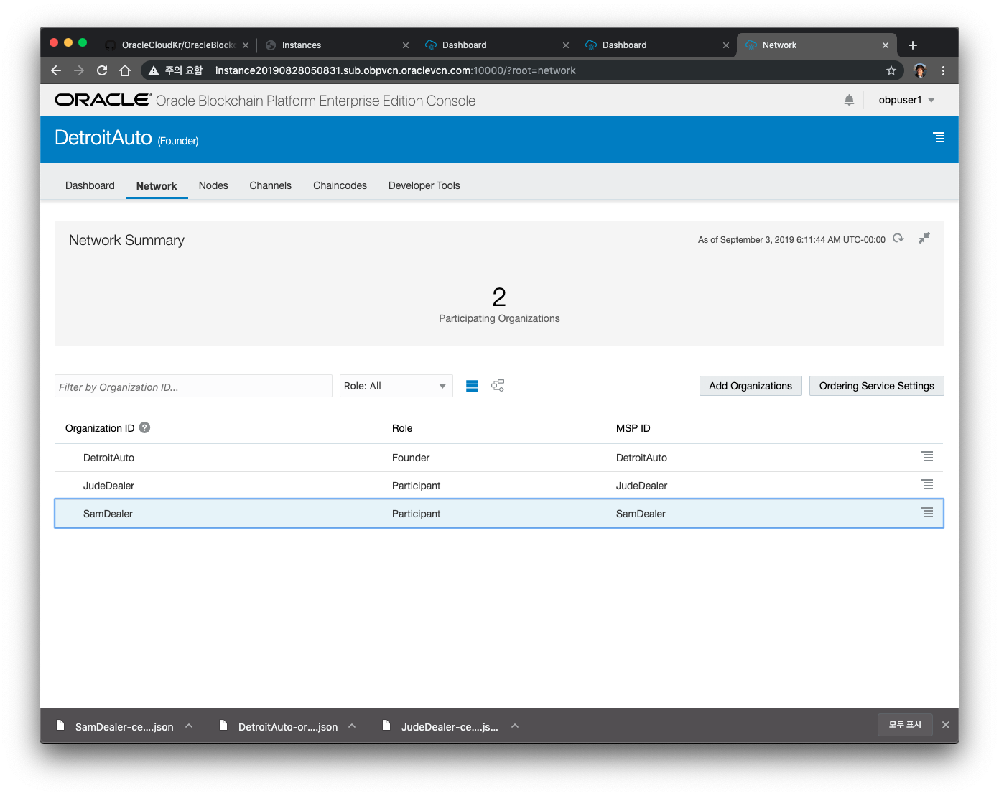

# Founder에 Participant Join 하기
### A. Founder에 JudeDealer Participant 조직(Organization)을 Join하기
1. 이전 Lab에서 Provision을 수행하게 되면 각각의 인스턴스 관리 콘솔에 액세스 할 수 있습니다. Blockchain Platform Manager 콘솔에 접속한 후 
먼저 **JudeDealer** 의 콘솔에 접속하기 위해 아래 그림과 같이 Service Console 을 엽니다.

2. Founder는 Participant Org의 두 가지 정보가 필요합니다. 첫째는 참가하는 Org를 검증 하기 위한 인증서가 필요하고, 두번째는 Org에서 관리하는 피어 노드에 대한 정보입니다. 
Participant의 인증서를 가져오기 위해 Participant Org의 콘솔(**JudeDealer 콘솔**)을 엽니다. 

3. **Export** 버튼을 눌러 **JudeDealer-certificates.json** 파일을 서버로 부터 로컬 컴퓨터에 다운로드 합니다.
다음 단계는 접속하고자 하는 Founder의 Orderer 정보를 import 해야 합니다. **Import Orderer Settings**를 클릭합니다.

4. 다시 Blockchain Platform Manager 콘솔에서 DetroitAuto 인스턴스 콘솔에 접속합니다.

5. **DetroitAuto** Founder 조직의 콘솔로 이동해서 **네트워크** 탭을 선택하십시오. 그런 다음 **DetroitAuto** 조직의 햄버거 메뉴를 클릭하여 Orderer 설정파일을(DetroitAuto-orderer-settings.json) 내보냅니다. 내보낸 파일을 저장하십시오.

6. 다시 **JudeDealer** 콘솔로 이동해서 **Upload Orderer Settings** 를 클릭합니다. 그리고 앞에서 다운로드 한 **DetroitAuto-orderer-settings.json** 를 선택합니다.

7. 선택한 파일이 정상적으로 upload 되면, 이 파일을 Import를 클릭해서 반영합니다. 마지막으로 Complete 단계를 클릭합니다.

9. JudeDealer의 콘솔 화면의 정보들을 확인할 수 있습니다.

10. 이제 Founder인 DetroitAuto에서 참가자인 **JudeDealer**를 추가해 주어야 합니다. DetroitAuto 콘솔의 Network 탭으로 이동해서 **Add Organizations** 버튼을 클릭합니다.

10. **Upload Organization Certificates** 버튼을 클릭한 후 앞에서 다운로드 한 **JudeDealer-certificates.json** 파일을 선택하고 Add 버튼을 눌러 Org를 추가합니다.

11. 다음과 같이 JudeDealer 가 Participant로 정상적으로 등록된 것을 확인할 수 있습니다.

### B. Founder에 SamDealer Participant 조직(Organization)을 Join하기

1. 위와 동일한 방식으로 **SamDealer** Org를 Founder에 추가합니다. 
SamDealer까지 추가하게 되면 다음과 같은 모습이 되어야 합니다.

---
[이전 Lab으로 이동](README.md)
