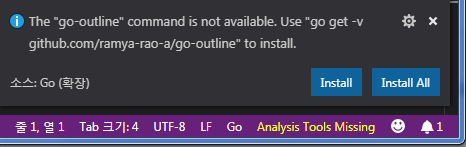
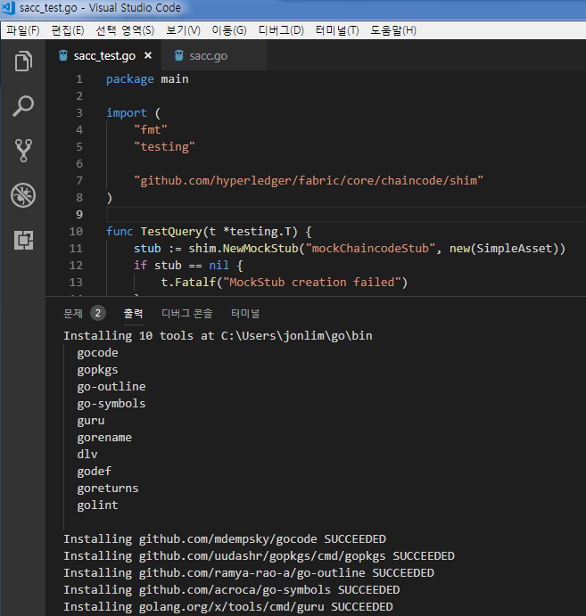
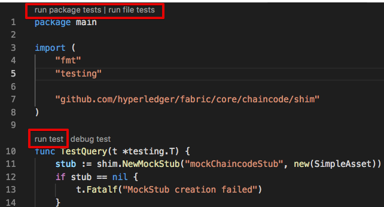
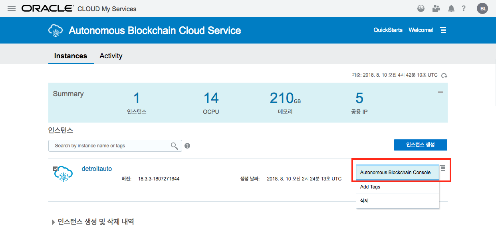
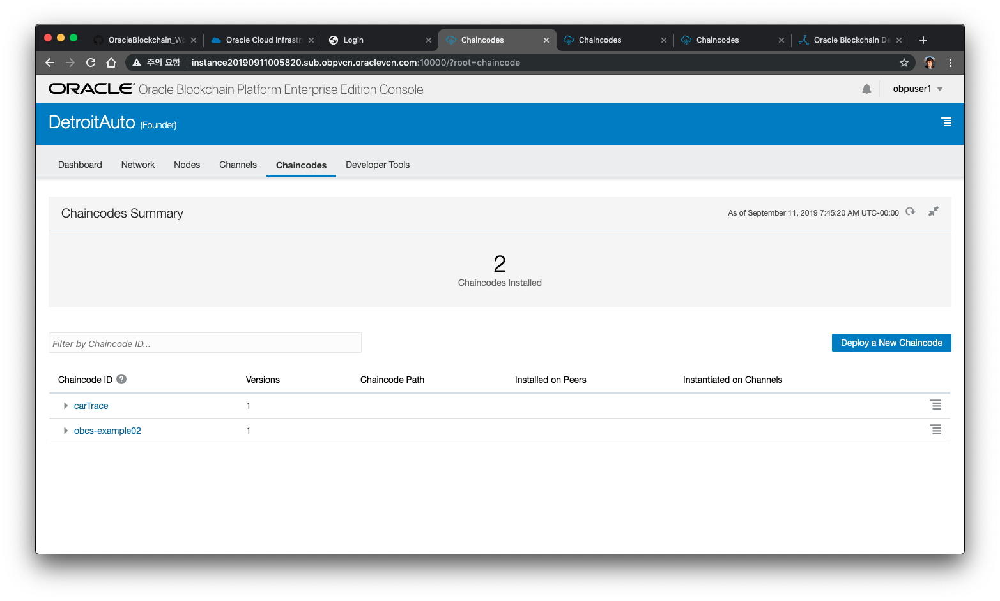
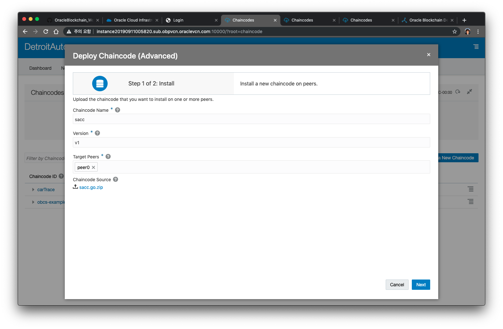
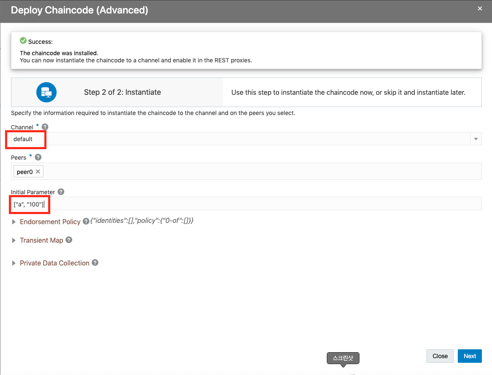
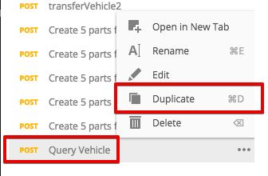
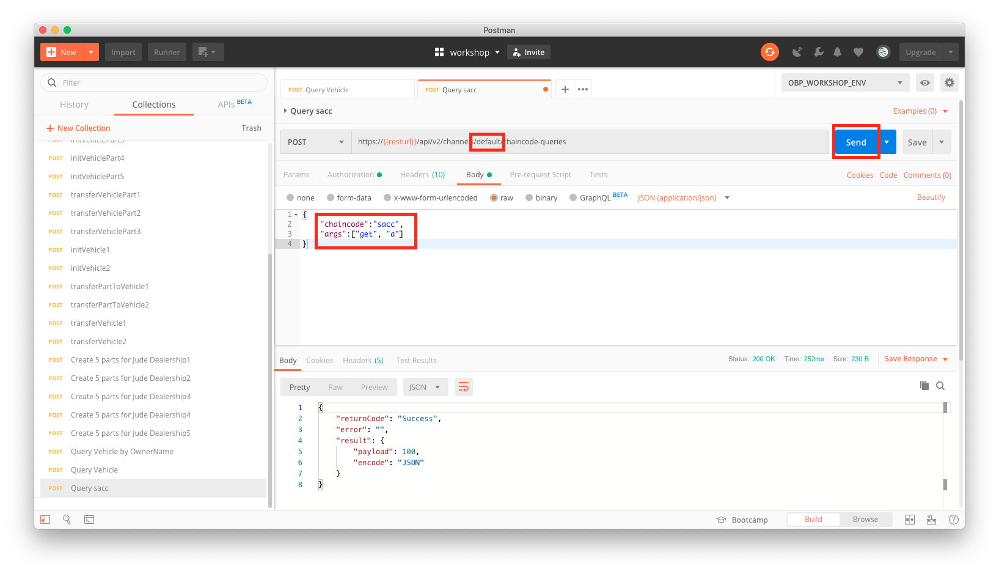

# ChainCode 개발하기 #
-----
## 사전 준비사항 ##
+ Oracle Cloud Trial Account ([Trial 계정 신청하기](http://www.oracloud.kr/post/oracle_cloud_trial_universal/))
+ 이전 Lab인 CarDealer Lab을 완료하거나, BlockChain Cloud Service에서 Provisioning한 인스턴스 필요
+ 개발 툴 ([Visual Studio Code](https://code.visualstudio.com/))

## 소개 ##
이번 Lab에서는 체인코드를 개발하는 방법에 대해 학습하고 간단한 체인코드를 개발해서 Oracle Blockchain Cloud Service에 배포하는 과정을 실습합니다.

## Hyperledger Chaincode 시작하기

참고 : http://hyperledger-fabric.readthedocs.io/en/latest/index.html

## Chaincode란?

Chaincode는 Hyperleger위에 돌아가는 SmartContract 코드로서 Ledger를 저장할 때 비지니스 로직을 실행하게 할 수 있습니다. Chaincode는 Transaction에서 Ledger를 쿼리하거나 Update하기 위해 호출됩니다.
현재 Oracle ABCS 는 Hyperledger 1.1 버전과 호환되며, 지원되는 언어는 Go와 Node.js 입니다. (Java 도 지원 예정)

## Chaincode API란?
Chaincode 프로그램은 Chaincode 인터페이스를 구현해야 합니다.
- [Go](https://godoc.org/github.com/hyperledger/fabric/core/chaincode/shim#Chaincode)
- Node.js

다음은 Chaincode 인터페이스의 주요 함수들입니다.
- **Init method** : Instantiate 나 upgrade 시에 호출
- **Invoke method** : invoke 트랜잭션 요청을 받을 때 호출

- shim 패키지에는 다른 인터페이스인 chaincodeStubInterface가 있는데 ledger에 액세스해서 수정하고 chaincode들 사이에서 호출하는데 사용됩니다.

# Lab 시작
## 개발 환경 준비하기
1. Visual Studio Code와 Go lang 설치를 위한 개발환경 준비는 아래 링크를 참고하시기 바랍니다.

    [개발 환경 준비하기](prepare_dev_env.md)

1. chaincode package 설치
   
   아래 명령어를 command에서 실행해서 go에서 사용할 chaincode package를 다운로드 합니다.

    | go get -u github.com/hyperledger/fabric/core/chaincode/shim |
    | --- |

## Simple Asset Chaincode 작성하기
1. $GOPATH/src/에 sacc.go 라고 하는 새로운 파일을 하나 생성합니다.

    간단히 ledger에 assets(Key-value 쌍)을 생성하는 기본 chaincode를 만들도록 하겠습니다.

    먼저, 모든 체인 코드는 [Chaincode interface](https://godoc.org/github.com/hyperledger/fabric/core/chaincode/shim#Chaincode)인 Init 및 Invoke 함수를 구현해야 합니다.

    체인코드에서 필요한 패키지를 추가하기 위해 go import 문을 추가합니다.
    체인코드 shim 패키지와 peer protobuf 패키지를 import합니다. 

    다음으로 Chaincode shim 함수의 SimpleAsset 구조체를 추가해 보겠습니다

    <pre></code>
    package main
    import (
    "fmt"

    "github.com/hyperledger/fabric/core/chaincode/shim"
    "github.com/hyperledger/fabric/protos/peer"
    )
    // 저장하기 위한 구조체인 asset을 관리하기 위한 간단한 체인코드 
    type SimpleAsset struct {
    }
    </code></pre>

2. Chaincode 초기화
   
    다음 Init 함수를 구현할 것입니다.
    
    <pre><code>
    // 체인코드가 instantiate될때 호출이 되며, 초기데이터를 설정하기 위해 사용합니다.
    func (t *SimpleAsset) Init(stub shim.ChaincodeStubInterface) peer.Response {

    }</code></pre>

    | 주의 : Chaincode upgrade 역시 이 함수를 호출합니다. 기존 코드를 upgrade할 Chaincode를 작성할 때 Init 함수를 적절하게 수정해야 합니다. 특히 Upgrade의 일부로서 초기화할 것이 아무것도 없는 경우 위와 같이 비어 있는 Init 메소드를 제공해야 합니다. |
    | --- |

3. init Parameter 유효성 검사
   
    다음으로 Init 호출될때 특정값들이 정상적으로 들어 왔는지 유효성 검사를 하는 코드를 넣도록 하겠습니다.
    입력 받은 값을 얻기 위해서는 ChaincodeStubInterface.GetStringArgs 함수를 사용합니다.
    체인코드를 Instantiate 할 때나 Upgrade 할 때 입력하는 값이 이 함수로 전달되게 됩니다.

    <pre>
    func (t *SimpleAsset) Init(stub shim.ChaincodeStubInterface) peer.Response {
      <b>args := stub.GetStringArgs()</b>
      if len(args) != 2 {
        return shim.Error("Incorrect arguments. Expecting a key and a value")
      }

      // PutState를 호출하여 ledger에 key/value를 저장
      err := <b>stub.PutState</b>(args[0], []byte(args[1]))
      if err != nil {
        return shim.Error(fmt.Sprintf("Failed to create asset: %s", args[0]))
      }
      return shim.Success(nil)
    }
    </pre>

    입력값이 유효하다는 것을(2개의 파라미터 임을) 확인한 후에는 ledger에 입력 받은 값을 저장합니다. 
    이를 위해 인수로 전달 된 Key와 Value값으로 ChaincodeStubInterface.PutState를 호출 할 것입니다. 모든 것이 성공적으로 끝나면 Peer.Response 객체에 Success 값을 넣어 반환합니다.

4. Invoking the Chaincode

    체인코드에 들어 있는 값들을 호출하는 함수를 구현해보도록 하겠습니다.

    <pre><code>
    func (t *SimpleAsset) Invoke(stub shim.ChaincodeStubInterface) peer.Response {
    }</code></pre>

    Invoke 함수의 파라미터는 [function이름+파라미터 배열] 로 구성되어 있습니다.

    이 값들은 ChaincodeStubInterface.GetFunctionAndParameters를 호출하여 함수 이름과 파라미터를 추출할 수 있습니다.

    이 예제에서는 function을 get과 set 두 가지 로만 제한하도록 하겠습니다.

    <pre><code>
    func (t *SimpleAsset) Invoke(stub shim.ChaincodeStubInterface) peer.Response {
        <b>fn, args := stub.GetFunctionAndParameters()</b>

    }</code></pre>

    fn 변수에 함수이름이 들어가게 되고, args에는 나머지 파라미터들이 들어가게 됩니다.
    fn의 함수명에 맞게 set과 get 함수들을 별도로 호출하도록 구현해보겠습니다.

    <pre><code>
    func (t *SimpleAsset) Invoke(stub shim.ChaincodeStubInterface) peer.Response {
        fn, args := stub.GetFunctionAndParameters()

        var result string
        var err error
        if fn == "set" {
            result, err = set(stub, args)
    } else {
            result, err = get(stub, args)
    }
    if err != nil {
            return shim.Error(err.Error())
    }

    // 각 함수에서 받은 결과를 Success payload로 실어서 반환
    return shim.Success([]byte(result))
    }
    </code></pre>

1. Chaincode 애플리케이션 구현

    이제 get, set 함수들을 구현해 보겠습니다. 

    ledger의 상태에 액세스하려면 chaincode shim API의 ChaincodeStubInterface.PutState 및 ChaincodeStubInterface.GetState 함수를 활용해야 합니다.

    <pre><code>
    // ledger에 key/value를 저장합니다. 만약 키가 있으면 새로운 값으로 override 합니다.
    func set(stub shim.ChaincodeStubInterface, args []string) (string, error) {
        if len(args) != 2 {
                return "", fmt.Errorf("Incorrect arguments. Expecting a key and a value")
        }

        err := stub.PutState(args[0], []byte(args[1]))
        if err != nil {
                return "", fmt.Errorf("Failed to set asset: %s", args[0])
        }
        return args[1], nil
    }

    // 특정 key에 대한 value를 반환합니다.
    func get(stub shim.ChaincodeStubInterface, args []string) (string, error) {
        if len(args) != 1 {
                return "", fmt.Errorf("Incorrect arguments. Expecting a key")
        }

        value, err := stub.GetState(args[0])
        if err != nil {
                return "", fmt.Errorf("Failed to get asset: %s with error: %s", args[0], err)
        }
        if value == nil {
                return "", fmt.Errorf("Asset not found: %s", args[0])
        }
        return string(value), nil
    }
    </code></pre>

1. 메인 함수 추가

    마지막으로 shim.Start를 호출할 main 함수를 추가해야 합니다.

    <pre><code>
    package main

    import (
        "fmt"

        "github.com/hyperledger/fabric/core/chaincode/shim"
        "github.com/hyperledger/fabric/protos/peer"
    )

    type SimpleAsset struct {
    }

    ...

    func main() {
        if err := shim.Start(new(SimpleAsset)); err != nil {
                fmt.Printf("Error starting SimpleAsset chaincode: %s", err)
        }
    }
    </code></pre>

**전체 소스 코드는 아래에서 다운로드 받으실 수 있습니다.**
  
[체인 코드 프로그램 소스 링크](./sacc.go)


## Chaincode 테스트
  
go chaincode는 테스트를 할 수 있는 환경을 제공합니다.
테스트용 파일을 만드는 데는 몇가지 규칙이 있습니다.

* 체인코드와 같은 디렉토리에 test파일을 만듭니다.
* 파일명은 _test.go 로 생성합니다.
* "testing" 을 import 합니다.
* shim.NewMockStub 객체를 생성합니다.
* 테스트 함수명은 대문자로 Test로 시작하도록 만듭니다.
* 동일한 디렉토리에 여러개의 test 파일을 생성할 수 있지만 함수명은 유일해야 합니다.
* 체인코드에서 GetHistoryForKey 등의 함수를 호출한 경우는 현재 테스트가 지원되지 않습니다.


1. 테스트 코드 파일 작성을 위해 sacc_test.go 라는 파일을 만듭니다.
   
    shim.NewMockStub를 이용하면 체인코드를 hyperledger에 배포하지 않고서도 로컬환경에서 테스트를 수행할 수 있습니다.

    ````
            // 테스트 stub 객체 생성
            stub := shim.NewMockStub("mockChaincodeStub", new(Asset Name))
            // 함수 호출(첫번째 인자는 function이름, 나머지는 파라미터)
            invokeResult := stub.MockInvoke("1", args)
    ````
    Asset Name은 위의 예제에서는 sacc 에서 struct 정의한 SimpleAsset을 입력을 합니다.

2. TestQuery라는 함수를 만듭니다. 여기에서는 set 함수를 호출한 후 get 함수를 호출하게 됩니다.
    아래는 invoke 함수를 호출하는 테스트 샘플 코드입니다.

    ````
    func TestQuery(t *testing.T) {
        stub := shim.NewMockStub("mockChaincodeStub", new(SimpleAsset))
        if stub == nil {
            t.Fatalf("MockStub creation failed")
        }
        args := [][]byte{[]byte("set"), []byte("A"), []byte("100")}
        invokeResult := stub.MockInvoke("1", args)

        args = [][]byte{[]byte("get"), []byte("A")}
        invokeResult = stub.MockInvoke("1", args)
        fmt.Printf("Payload=%s", invokeResult.GetPayload())

        if invokeResult.Status != 200 {
            t.Errorf("returned non-OK status, got: %d, want: %d.", invokeResult.Status, 200)
        }
    }

    ````

    전체 테스트 소스 코드는 아래의 링크에서 받을 수 있습니다.

    [테스트 프로그램 소스 링크](./sacc_test.go)

## Chaincode 테스트 plugin 설치
Visual Studio Code 툴에서는 자동으로 go test를 호출하는 plugin을 지원합니다.
sacc_test.go 파일을 열게 되면 Visual Studio Code에서는 자동으로 plugin을 인식을 하게 됩니다.

오른쪽 아래에 다음과 같이 plugin을 설치하라는 메세지가 뜨게 되면 Install All 버튼을 눌러 관련 plugin을 모두 설치합니다.



* 만약 메세지가 뜨지 않을 경우에는 cmd 창에서 아래 명령어를 직접 실행하시면 됩니다.

| go get -v github.com/ramya-rao-a/go-outline |
| --- |

설치를 하게 되면 아래와 같이 plugin 모듈이 하나씩 설치가 되게 됩니다.


정상적으로 설치가 되면 sacc_test.go 파일에 함수이름 위에 직접 테스트를 할 수 있는 명령어가 자동으로 뜨게 됩니다.



이제 TestQuery 위에 있는 run test를 눌러서 실행을 해봅니다.

<pre><code>
Running tool: /usr/local/go/bin/go test -timeout 30s -run ^TestQuery$

Payload=100PASS
ok  	/Users/user1/Workshop/Blockchain_Workshop/ChaincodeDev	0.026s
Success: Tests passed.
</code></pre>

## Chaincode OABCS에 배포

위와 같이 정상적으로 테스트가 끝나면 OABCS에 체인코드를 배포할 수 있습니다.
OABCS는 .go 파일을 zip으로 압축해서 배포하면 됩니다.

1. 먼저 sacc.go 파일을 zip으로 압축합니다.

2. OABCS 의 콘솔에 접속합니다.

   이전 Lab에서 만든 detriot 인스턴스의 Dashboard Console로 이동합니다.


1. Chaincodes 탭으로 이동한 후 'Deploy a New Chaincode' 버튼을 클릭합니다.

    
    
1. Deploy Chaincode에서 이번에는 Quick Deployment를 사용해서 바로 Deploy를 선택합니다.
   
   이 옵션을 선택하게 되면 Deploy함과 동시에 모든 peer 에 대해서 instantiate까지 한번에 해주게 됩니다.

    

1. 아래 화면과 동일하게 선택,입력하고, 초기 파라미터로 ["a", "100"] 을 입력합니다. 
    
    앞에서 압축한 chaincode zip 파일을 선택합니다.

    

1. submit을 누르면 정상적으로 Deploy가 완료되고 Instantiate가 되게 됩니다.
   
## Chaincode REST로 호출하기
이제 Deploy된 체인코드를 REST Api를 통해 호출해 보도록 하겠습니다.
1. Postman을 다시 열고 좌측 메뉴에서 기존 Request들 중에 마지막에 있는 Query Vehicle을 선택하고 Duplicate를 해서 복사를 합니다.
   
2. 이름을 Query sacc로 변경하고 Body를 클릭한 후 아래의 값으로 입력합니다.
   
3. Send 버튼을 클릭하면 체인코드가 호출이 되고 앞에서 체인코드 초기화 때 입력한 100 값이 반환되는 것을 확인할 수 있습니다.

-----
<b>수고하셨습니다. 모든 Lab 과정을 끝내셨습니다.</b>

[이전 Lab으로 이동](../README.md)
