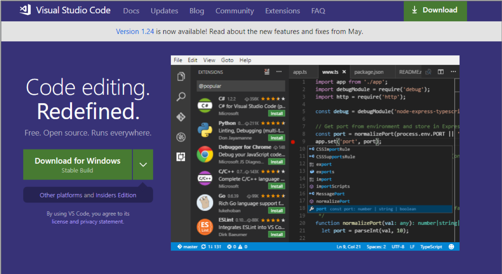
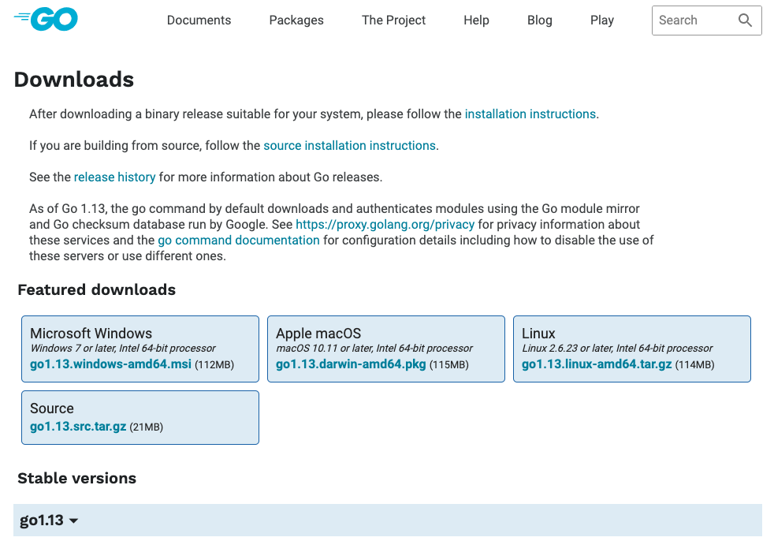
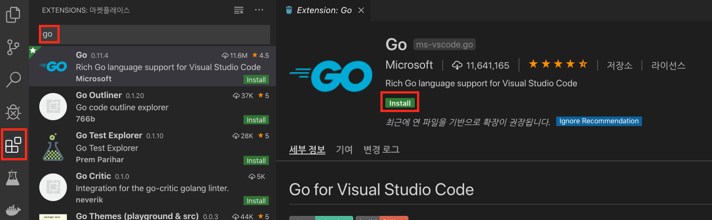

## Hyperledger Chaincode 개발 환경 만들기
개발 툴인 VisualStudio Code와 Go 언어를 설치합니다.

| Hyperledger 체인코드를 개발하기 위해서는 로컬에 Hyperledger 를 설치하는 것이 좋습니다. Hyperledger에서는 네트워크 구성이 단순하게 되어 있는 Devmode를 제공합니다.

https://hyperledger-fabric.readthedocs.io/en/master/chaincode4ade.html 참고

이번 Lab에서는 Hyperledger를 설치하지 않고 더 간단하게 테스트 하는 MockStub을 이용해 테스트하는 환경을 준비할 에정입니다. MockStub은 다소 제약사항이 있긴 하지만 간단하게 테스트 하는 목적으로 이용하기에는 좋습니다. |
| --- |

### 1. 개발 툴 설치
Visual Studio Code는 아래의 링크에서 다운로드 받으실 수 있습니다.
([Visual Studio Code](https://code.visualstudio.com/))

### 2. Go Lang 설치

Hyperleger는 Go는 1.10.x 이상이 설치되어 있어야 하고 

[Go 다운로드](https://golang.org/dl/)

설치 후에는 <b>GOPATH</b>가 시스템 환경 변수로 설정 되어 있어야 합니다. 
또한 PATH에 GOPATH/bin 이 잡혀 있어야 합니다.

### 3. Visual Studio 툴에 Go 확장 Plugin 설치
Visual Studio Code 에서는 왼쪽 메뉴에서 네모난 모양의 아이콘을 클릭하면 Plugin을 설치하는 화면이 나옵니다.
거기에서 go를 검색한 후 go plugin을 설치를 클릭합니다.

